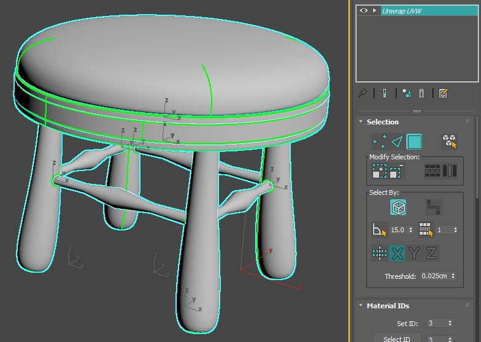

# UV Coordinates

*Version 1.0.0*\
Last Updated: October 20, 2020

[<ins>Return to <em>Asset Creation Guidelines Summary</em></ins>](/asset-creation-guidelines/RealtimeAssetCreationGuidelines.md)

## UV Layout

UV layout / UV mapping is a process by which an artist takes their 3D model and creates flattened 2D representations of its various surfaces so that texture maps can be accurately projected onto it. This resulting 2D representation is considered an **unwrapped** UV Map, and it allows for efficient texturing. Be aware that complex models may have multiple individual elements where each part of the model uses its own separate UV layout. 

For the purposes of this initial guide, we’ll be looking at how UV Coordinates can be constructed specifically with real-time use cases in mind. 

The letters **U** and **V** refer to the two axes of the 2D UV map equivalent to **X** (or horizontal)  and **Y** (or vertical) axes, and the results are normalized in UV space between 0 and 1.

    (C)2020, TurboSquid. License: CC BY 4.0 International
    Figure 4.1: Simple Chair Model UV Layout

At a high level, most real-time engines (including Unreal Engine and Unity) require that a 3D model include UV Mapping in order to display correctly, and for models designed to be used within e-commerce experiences, having UVs for your entire model is an essential part of the creation process. 

UV Layout also ties in closely with how an artist builds their bitmap textures and materials, as you can’t assign textures to your model effectively without having UVs, so creating clean UVs for your finished geometry is a highly important first step.

How an artist approaches the creation of their UVs can vary by the object they are unwrapping, and there are many ways to split your model up so that it has good UVs. Artists are free to use a combination of manual and automatic unwrapping methods to get the results that they need. To be clear, there is no one correct way to unwrap your model. Shown below are 3 different ways to get the same result on a simple cube.

    (C)2020, TurboSquid. License: CC BY 4.0 International
    Figure 4.2: Multiple UV Layout options for a cube

    (C)2020, TurboSquid. License: CC BY 4.0 International
    Figure 4.3: UV Cube

All of these layouts can produce perfectly acceptable results, and each way of laying the UVs out will have their own benefits, so it’s more a matter of following a reasonable approach to getting the results you want. 

To start, once you have a model built it’s important to consider **how** you will unwrap it before you dive in. Throughout this section, we will utilize a generic stool model as the example. 

    (C)2020, TurboSquid. License: CC BY 4.0 International
    Figure 4.4: Stool model file

In the example above, the model is composed of 11 separate pieces, and each piece has been color coded to indicate the materials that are to be applied. The intent is to have 3 different materials: to have wooden legs (4 elements total), cross supports (4 elements total) and seat base (1 element total), with a metal band around the wooden seat base (1 element total) and a fabric/leather seat cushion on top (1 element total). This first bit of information will give us some possible layout options (e.g. - keeping similar material UV islands together). 

Before you begin to unwrap your model, it is important to consider how to best assist in creating materials that will be applied later. For the seat cushion, is the material going to be a procedural leather, or a scanned fabric swatch material? Is the wood for the model going to be painted a solid color, or does the artist need to worry about the grain and orientation for the wood itself? Answering some initial questions about what is important will help inform later steps. For real-time, e-commerce applications where UV mapping is required, an artist should be prepared to ensure all of their model components contain UVs and for all of the UVs to be atlased into one texture set. 

## Seams Placement

One of the first things to consider when looking to unwrap a model is where the seams should live. Since you’re going to be breaking the model into multiple components and flattening those UV shells so bitmap textures can be applied to them, you need to figure out where the breaks (seams) should exist. 

In general, you should endeavor to place your UV seams so that they mimic the natural breaks within the real world version of the model or they should be hidden in less vital areas. Visible seams can be jarring and break the realistic appearance of a model. Consider how fabric is applied to a pillow cushion. In the example image below, the primary seam (indicated in green) represents the edge where the real-world fabric would be stitched together when the item is being manufactured. 

    (C)2020, TurboSquid. License: CC BY 4.0 International
    Figure 4.5: The UV seam on this pillow is placed on the upholstery seam for a natural, realistic break in the texture

For furniture and other models that have specific fabrics or materials assigned to portions of them during physical manufacture, determining where those natural breaks occur in the real item and using them as a guide to cut apart your model for its UVs is a great starting point.

In the case of our furniture example model, let’s consider the approach to take on where to place the seams. Let’s start with the rounded legs since solving the UVs for one of them can then be repeated on the other three. 

    (C)2020, TurboSquid. License: CC BY 4.0 International
    Figure 4.6: Wooden Leg UV consideration

Looking at the geometry, an artist could technically place a vertical UV seam anywhere (since the form is cylindrical). But given the best practice of hiding UV seams in less visible locations that is preferred, it would appear to make sense to put the UV seam on the inner edge as shown below. 

    (C)2020, TurboSquid. License: CC BY 4.0 International
    Figure 4.7: Initial UV Seam placement

But it’s also important to consider the rest of the form, namely the rounded bottom of the leg and the circular indents where the crossbars insert. Simply splitting the leg with one edge will cause heavy distortion on a resulting texture map.

    (C)2020, TurboSquid. License: CC BY 4.0 International
    Figure 4.8: Distortions on unwrap with only one UV seam shown in red and blue

Given the forms included, revising the UV seam placement in such a way to include those other aspects of the geometry might lead an artist to something like this:

    (C)2020, TurboSquid. License: CC BY 4.0 International
    Figure 4.9: Revised UV Seam placement
 	

    (C)2020, TurboSquid. License: CC BY 4.0 International
    Figure 4.10: Lack of distortions from UV layout

Note that the decisions for UV seam placement now include the rounded base of the leg, and have explicitly carved out both of the insets as their own UV islands. This maintains the concept of hiding UV seams in less visible areas, while also helping minimize distortion of future texture mapping (which will be covered in the next section). To be clear, this is NOT the only way to place UV seams on this model, but was made with the following ideas in mind:

1. Hide the UV seams as much as possible
2. Create the fewest number of UV shells possible so that any UV layout and texturing becoming easier

For more complex models (like this stool, or a chair or table), breaking the model down by part (legs, frame, etc.) and then placing seams in hidden or less visible areas on each component will help minimize their impact. For cylindrical components, determining where the seams live is a matter of personal preference, but as you can see below, having the seams on the backs or inside edges of the elements (where viewers will look less often) is generally considered desirable.

    (C)2020, TurboSquid. License: CC BY 4.0 International
    Figure 4.11: Splitting the leg UV on the back helps hide the UV seam

## UV Orientation & Distortion Artifacts

As you begin to lay out your UVs, it’s recommended that you apply a temporary visual UV tile bitmap to your model to help you ensure that your UVs are oriented in the proper directions in relation to the textures you plan to apply. In most cases, these UV bitmaps will have textures, grid lines and other visual indicators like arrows or text to help identify scale and orientation and there are plenty available for free for use in your work. (Google Image search for "texture UV grid" is a good starting point) 

    (C)2020, TurboSquid. License: CC BY 4.0 International
    Figure 4.12: Example 3m x 3m UV bitmap with 10cm grid lines and arrows for orientation

    (C)2020, Microsoft. License: CC BY 4.0 International
    Figure 4.13: Example UV Tile Map with text and numbers from Microsoft Babylon.js team

    (C)2020, TurboSquid. License: CC BY 4.0 International
    Figure 4.14: 1m cube with Orientation UV bitmaps applied

These maps also serve to help visually identify areas where UV shells are distorted, poorly laid out or have flipped UVs so that they can be fixed prior to creating the materials and texture maps for the model. This is done by looking at the square tiles contained within each map itself, and when applied to geometry they can help let you know if your UVs are stretched, compressed or otherwise skewed. If inverted text or numerals appear on the model, it also helps identify UV shells that need to be flipped so that the UVs face in the right direction. 

    (C)2020, TurboSquid. License: CC BY 4.0 International
    Figure 4.15: Flipped UVs visible on cushion from UV bitmap texture

When used in concert with UV Seam placement, you can quickly begin to understand how easy or difficult your model will be to texture as you’re unwrapping it. Consider a pillow and cushion on a sofa. 

    (C)2020, TurboSquid. License: CC BY 4.0 International
    Figure 4.16: Good Seam Placement along natural edges of cushions

As you can see from the images above, there is minimal distortion of the UVs (the square grid pattern isn’t deformed badly or obviously), and it’s visually very easy to understand how the UV layout is oriented in relation to the model itself. The flow of the arrows in this UV bitmap makes understanding the orientation of the UVs self-evident. In these cases, the UV layouts of these two objects match how a fabric might be applied to a physical version being manufactured.

Moreover, in this case the scale of the UV bitmap gives an indication as to the physical size of the models. Given each grid square in this particular UV bitmap instance represents 0.1 meter in length, an artist can also visually tell that the pillow is roughly 0.4 meters wide (roughly 16”), and that the sofa cushion is 0.6 meters wide (roughly 24”). 

By contrast, looking at the UV bitmap on bad seam placement and orientation will reveal a host of potential issues. 

    (C)2020, TurboSquid. License: CC BY 4.0 International
    Figure 4.17: Poor Seam Placement (notice the flow and cleanliness of the patterns break)

In examining the images above, the UV layouts for these models ignore natural breaks in the geometry where seams should exist, and the orientation of the UVs is quite haphazard with the flow and direction going in seemingly random directions. This will make trying to texture these models much more difficult. Additionally, given the intended scale of the UV bitmap applied, the apparent size of the models is completely ignored as well. The sofa cushion is now 1.1 meters in width (43”) and the pillow is even bigger at roughly 1.5 meters wide (59”). And while real-world scale of textures can be adjusted (and this will be discussed later as part of using tileable scanned textures), it is recommended that artists keep scale in mind whenever possible as part of your UV layout process. 

Likewise, the UV bitmap can help you readily spot distortion and scaling issues within your mapping layout as you work. To be clear, minor distortion is sometimes unavoidable (especially on curved and rounded surfaces), but artists should endeavor to minimize any visible stretching or tearing of applied maps as this will make it much more difficult to manage the process of creating a final material that does not display the same distortion artifacts. 

    (C)2020, TurboSquid. License: CC BY 4.0 International
    Figure 4.18: Bad UV layout produces visible stretching and tearing on seat cushion

As can be seen above, the UVs of the seat cushion are obviously not clean and produce stretching and tearing (the odd, unexpected warping and smearing as the UV texture map wraps at the top and bottom edges). The UV texture above also shows the grid as very uneven, with some grid areas looking less square (which is how they should appear) and more rectangular towards the edges (which indicates poor UV creation). As such, it’s important to train your eye to spot these sorts of inconsistencies, and when found, to edit the UVs to restore that even distribution as much as possible. 

Many modern UV tools can now show UV distortions as you begin to lay out your UV shells. They do this by generally color coding areas of stretching and compression, making the management a much more visual and intuitive process.

Let’s use the stool model above with it’s UVs to review how to identify and deal with the distortion. Visual inspection in 3ds Max immediately shows a number of issues. 

1. The UVs on the cushion are heavily distorted along the edges.
2. The relative scale of the UVs are quite different as can be seen in the grid pattern size differences between the various parts of the model (we’ll deal with this problem in another section)
3. The flow and direction of the UVs varies in some spots.

Opening the cushion in a UV editor that includes distortion color coding can significantly speed your process up, so this is recommended. Right now, tools like 3ds Max, Maya, UV Layout, and RizomUV are great choices. 

    (C)2020, TurboSquid. License: CC BY 4.0 International
    Figure 4.19: UV stretch distortion visualization in 3ds Max, Maya and UV Layout

In 3ds Max, you can activate the visual distortion tools within the Unwrap UVW modifier’s Edit UVWs dropdown window, by selecting the **Area Distortion** display.

    (C)2020, TurboSquid. License: CC BY 4.0 International
    Figure 4.20

In Maya, you simply activate the UV Distortion display in the UV Editor.

    (C)2020, TurboSquid. License: CC BY 4.0 International
    Figure 4.21

Using the visual indicators, it’s obvious that there is heavy stretching (bright red) on the edges of the cushion. This is due to the original application of a planar map being used to UV map that model. In order to correct this, we need to come up with another way to split the curved mesh to flatten it out as much as possible so that the UV texture wraps more predictably around the edges. 

In this case, a solution was derived from the edge flow of the polygons along it’s natural seams. 

    (C)2020, TurboSquid. License: CC BY 4.0 International
    Figure 4.22: Minimal UV Distortion (pale blue: compression, pale red: stretching)

As can be seen above, the distortion is now reduced significantly with just pale blue and pink tints to indicate some very minor compression and stretching. The resulting UV bitmap applied looks like this:

    (C)2020, TurboSquid. License: CC BY 4.0 International
    Figure 4.23

Given the new UV layout the UV bitmap tiles are far more even and square in shape, and the distortion is significantly reduced so that there is no visible stretching or tearing. The tradeoff is that there are four small seams that need to be hidden by the texture artist, but this should be a relatively straightforward task. Again, it’s important to reiterate that it is nearly impossible to completely eliminate texture distortion on curved surfaces like these (or the stool legs), so the goal is to minimize the visible stretching or compression. And to be clear, this isn’t the only way to UV this element, as there are a number of ways to split the mesh. Just remember to consider that a model may need to be UV’ed in a way that is consistent with the kind of material being applied. Here’s an alternative mapping as an example.

    (C)2020, TurboSquid. License: CC BY 4.0 International
    Figure 4.24: Alternative cushion UV mapping

Another consideration when it comes to distortion of UVs relates to the relative scale of the various UV islands in your layout. In most cases, the model should contain UVs such that when a UV texture is applied, that each piece of the model gets the same amount of visual texture space (often referred to as **Texel Density**). Consider the poorly UV mapped stool model. 

    (C)2020, TurboSquid. License: CC BY 4.0 International
    Figure 4.25: Bad UV Layout for Texel Density

While the UVs are all unwrapped, they have been assembled haphazardly, placed in different orientations and at various scales relative to one another within the UV space. For a component like the legs, the four UV shells are all different sizes and one is in a different orientation, meaning that each one will get a different amount of texture space and that texturing will be far more difficult than necessary because of the different orientation of the UV shell. 

Most UV technologies have a UV packing system that can help ensure the texel density is consistent. Within 3ds Max is the **Pack UVs** command under the Tools menu in the Unwrap UVW modifier is the starting point for ensuring even texture distribution.

    (C)2020, TurboSquid. License: CC BY 4.0 International
    Figure 4.26

Within Maya, using the **Layout **command in the Arrange and Layout rollout of the UV Editor will also help produce similar UV packing results.

    (C)2020, TurboSquid. License: CC BY 4.0 International
    Figure 4.27

By using these tools, the UVs will be organized, scaled and packed in such a way as to provide even texel density to all UV shells all within the UV space. In most cases, the tools will **not **reorient shells to align them, and it will be the responsibility of the artist to manually re-orient UV shells to their desired rotational angle before packing. The results of such a UV packing effort can be seen below.

    (C)2020, TurboSquid. License: CC BY 4.0 International
    Figure 4.28: Good UV Layout for even Texel Density

Once the UV shells were reoriented and repacked, this UV Layout shows very little distortion and provides even texel density as seen with the UV bitmap. Additionally, by manually rotating the UV shells for the legs and supports so that they all are oriented in the same direction, the packing tools have left them facing the same way, which will help with texturing later. 

One thing to keep in mind when considering texel density of the various UV shells, is there **are **instances where you might want to provide more texture space to specific parts of your model, and not to other areas. For instance, in the stool above, the wooden seat pan that exists below the cushion does take up a fair amount of texel density in the UV layout even though most or all of it won’t be seen. The same goes for the bottom of the cushion itself. Depending on the configuration of the model (does the stool come without a cushion where it would be visible?), the UVs can be further manipulated manually to achieve certain effects. 

In an effort to provide more texture space for the cushion UV shell, a good UV artist will continue to work on the UV layout manually to make the best use of space. In the case of the stool, the two UV shells that represent the wooden seat pan and base of the cushion (denoted in red below) were shrunk down relative to the rest of the visible model so those elements could be given more texture space. 

    (C)2020, TurboSquid. License: CC BY 4.0 International
    Figure 4.29: More optimized UV Layout for Texel Density

If you compare the prior image and this one, you’ll see that the amount of texture space for the cushion and other visible elements has been increased, while not showing any distortions or relative texel density differences. While this practice does not necessarily conform to evenly distributed texel density for the UVs, it can be used to emphasize or prioritize parts of your model that you want to stand out.  

## Real world scale

When building a model, taking into consideration its scale in the real world is obviously important. Building a model to real-world scale impacts how the model behaves in a number of essential ways including lighting, physics and placement size in the real world in the case of an Augmented Reality experience. If a model is built at the wrong scale, you’ll get unexpected results. It will also make texturing more difficult due to the scaling differential between what is expected and what occurs when you apply maps to the surface. 

Likewise, creating your UV Layouts to reflect real-world scale can be just as important. You want your UV shells to reflect the correct, real-world size of the textures relative to them. In many cases, an artist will be provided with bitmap textures of scanned or photographed fabrics or materials that have a defined size and represent a **tileable section** of that material. For textures that are easily measurable like fabrics and other textiles, setting up the UVs to match the proper scale of those textures is important. 

Given that several real-time publishing targets use 1 UV unit (0-1 space in both U and V) = 1 meter (glTF and USDz), it is recommended that you build your UVs with this texture scale in mind. By being consistent here, it will provide flexibility since real-world scale materials of the same size will immediately appear at the proper scale when applied by default. 

That does not mean that you have to build your models at meter scale. Smaller objects like clothing or hand-held electronics can still be built in centimeters or inches to get the precision desired (as well as avoiding some legacy 3D application display issues of modeling at larger unit scales), and only get converted to meter scale upon export. It’s worth noting that both the FBX and glTF exporters have settings to allow scale conversions. As such, it is **highly **advisable to do tests with conversions to ensure you get the proper scaling upon export and within your final delivery format. 

With regards to how to think about tileable textures, if you have a measured 10cm x 10cm checker bitmap texture, and want to apply it to a 5cm x 5cm object, you should only see a quarter of the texture on the output model if the UVs are constructed properly. Likewise, if you have a 1m x 1m object, you’ll see the same 10cm texture repeat 10 times across the surface.

    (C)2020, TurboSquid. License: CC BY 4.0 International
    Figure 4.30

This tiling texture concept is easy to understand, but only works on certain kinds of UV layouts and has several constraints. Since a tiled texture fills the UV space from 0-1 completely, it means UVs must align to it’s orientation and features. As an example, for furniture manufacturers that use specific “cut codes” or pattern layouts in their real-world designs so that the fabrics they use align in a specific way when stitched together, replicating that manufacturing process in 3D requires the UVs to be laid out relative to the tileable fabric texture itself - and this can often lead to UV shells being forced to live partially outside of the 0-1 UV space or overlap one another to achieve the proper alignment. While this is perfectly acceptable for many uses (such as offline rendering for websites or catalog imagery), for real-time applications this kind of UV layout will often cause problems and should be avoided **unless **the UVs all fit neatly within 0-1 UV space. Moreover, tiling texture UV layouts don’t support ambient occlusion outputs since UVs are managed in relation to the texture and not to the geometry. As such, generating AO maps becomes impossible for this sort of UV layout. Depending upon the desired publishing target (USDz vs. glTF), this may force some additional work. 

A small aside on publishing targets for real time applications and UVs. In most cases, companies will look to leverage as many different output target formats as possible to broaden their availability on AR and web-based e-commerce platforms. As of the middle of 2020, the two biggest formats for this sort of work are currently USDz and glTF, and it’s important to understand the constraints each of these put on an artist laying out the UVs with respect to real-world scale. 

*   glTF is more robust and can allow a mixture of tiled texture UVs and atlased UVs as two separate UV channels. This can be helpful when the main UVs are tiled and use real-world scale UVs that don’t necessarily fit neatly into 0-1 space, and the second set of UVs is atlased to produce ambient occlusion for the resulting model. This often has the advantage of allowing the consumer of the model to get very close to it since the primary UVs are tiled with the maps, while providing high fidelity at a distance with the AO information as well. 
*   USDz, which is Apple’s format to display models for AR experiences via iOS, is more restrictive and currently only supports a single UV channel for all of its maps. As such, an artist will have to consider whether it’s more important to sacrifice the AO information and keep the tiled UVs, or simply atlas all of the UVs to accommodate the various maps, including AO through texture baking. 

There is no hard and fast rule here as to which approach to take, and it is recommended that companies keep a PBR source model from which they can then derive multiple output targets to accommodate each output format. But in some cases, using an atlased UV workflow will be required in order to keep all elements inside the UV space. Using atlased UVs **also **affords texture artists the ability to apply non-tileable details (such as distressing or other geometry specific effects) to parts of the model that a tiled texture workflow also can’t support. 

There are a number of ways to ensure that your atlased UVs are set up to handle real-world scale bitmap textures. 

The most common is to build and pack the UVs into a typical atlas as has been discussed previously, then use the material and map controls to scale the textures so they represent the proper real-world size of the texture on the existing UVs. At its most basic, this involves creating a reference cube with both the cube and the bitmap texture set up to match its real-world scale, then using that cube as a visual guide in your scene to match the bitmap scale as it is applied to the model itself. By adjusting the tiling of the bitmap in relation to the UV shells, the entire material will be adjusted so that the model and the reference object match in terms of texture scale.

Let’s use the stool model as an example. By default, it’s atlased UV layout is fairly straightforward.

    (C)2020, TurboSquid. License: CC BY 4.0 International
    Figure 4.31: Stool UV Layout

Assume that the following material needs to be applied to the cushion, and that the material has been derived from a scanned fabric swatch that is 10cm x 10cm in length and width.

    (C)2020, TurboSquid. License: CC BY 4.0 International
    Figure 4.32: 10cm x 10cm Ugly fabric texture

By simply creating a material using this map and applying it to the stool cushion, the resulting scale will be way off.

    (C)2020, TurboSquid. License: CC BY 4.0 International
    Figure 4.33: RWS not accurate for cushion

While the cushion itself is roughly 60cm in diameter, this result is due to the fact that the cushion UV shell only accounts for a small portion of the atlased UV layout, and the tiled texture in the material takes up the entire UV space and represents only 10cm from edge to edge. To make it match properly, create a simple reference cube that represents the actual size of the fabric swatch. In this case, given the texture is 10cm x 10cm, the cube created will be built with dimensions of 10cm x 10cm x 10cm. 

    (C)2020, TurboSquid. License: CC BY 4.0 International
    Figure 4.34: Reference cube created to match bitmap size (10cm x 10cm)

Next, in order to help further visualize the texture scaling, a user should apply a simple checker pattern to the cube and ensure that it is representative of the 10cm x 10cm pattern. 

In 3ds Max, users can enable the **_Use Real-World Scale_** option in the mapping controls to explicitly set the size and type in the height and width values directly.

    (C)2020, TurboSquid. License: CC BY 4.0 International
    Figure 4.35

In Maya, simply ensure that the reference cube is the right dimensions and use a bitmap texture with the place2DTexture node’s **Repeat UV** settings to 1 and 1 respectively. 

    (C)2020, TurboSquid. License: CC BY 4.0 International
    Figure 4.36

With the checker map applied to the reference cube, create a duplicate material for the cushion that also contains the checker pattern and apply it to the model. The reason for the duplicate is that you can’t use the real-world scale option on the model with the bitmap texture given the atlased UV layout. By default, the checker pattern on the model will be at the wrong scale. 

    (C)2020, TurboSquid. License: CC BY 4.0 International
    Figure 4.37: Wrong texture scale

In 3ds max, using the U and V Tiling controls within the bitmap texture, scale the checker pattern to match the reference cube. 

    (C)2020, TurboSquid. License: CC BY 4.0 International
    Figure 4.38: UV Tiling match between reference cube and material applied

In Maya, adjust the Repeat UV parameters to match the scale of the reference cube.

Once the tiling has been determined with the checker, simply apply those same tiling values to the original material’s bitmaps to ensure that they match in scale. 

    (C)2020, TurboSquid. License: CC BY 4.0 International
    Figure 4.39: Original material at proper RWS within the UV atlas

Be aware that there are also scripted plug-ins and tools that can automate and help ensure that the tiling of your bitmap textures matches the real-world scale of that material via manipulation of the texel density including TexTools for 3ds Max and UV Mapping Toolbox for Maya, among others.

It’s important to note that using the Tiling value of the textures themselves is not something that can be exported to a format like glTF or USDz for real-time application, so the next step in ensuring the real-world scale textures are handled is to perform **texture baking** of the various parts of the model. 

In 3ds Max, select the geometry you want to bake the and open the **Render to Texture** dialog. Depending on the renderer used, select the various material components you need to render (PBR outputs generally include base color, roughness, normals and metallic).

    (C)2020, TurboSquid. License: CC BY 4.0 International
    Figure 4.40: Render to Texture dialog in 3ds Max

Then render the maps to a location on your disk.

    (C)2020, TurboSquid. License: CC BY 4.0 International
    Figure 4.41: Stool Cushion base color baked map output

Once done, you can build a new material containing the baked real-world scale maps and apply them to the model. At this point, the file will export and display the material properly as glTF / glB file for real-time work. 

    (C)2020, TurboSquid. License: CC BY 4.0 International
    Figure 4.42: Stool model in WebGL player

Similarly, in Maya, you can use the **Transfer Maps** tools within the Rendering panel under the Lighting/Shading menu to accomplish the same texture baking process.

    (C)2020, TurboSquid. License: CC BY 4.0 International
    Figure 4.43: Maya Transfer Maps location

Now, the most common workflow here is to get all of your real-world scale maps assigned first, then do your texture baking so that all of the maps can be combined at the end of the process. This example just showed how to handle a single element. 

The thing to remember is that it’s rarely possible to adjust your UVs to be real-world scale and have them fit within the UV 0-1 space. So in those cases, the best alternative is to tile your applied bitmap textures to reflect a real-world scale space so that you get predictable mapping and then bake down the textures from there. 

## Overlapping UVs Considerations in an Atlas Layout

Within the UV Mapping layout, you’ll have collections of polygons that are often referred to as **UV Islands** or **UV Shells**. These UV shells represent the various parts of your 3D model. As you start to unwrap your model, you might initially focus on separating parts out into obvious groupings before flattening them. For instance, on the stool model, you might separate the model by the legs, the seat, the cushion and so on, then unwrap those parts into their 2D representations.

    (C)2020, TurboSquid. License: CC BY 4.0 International
    Figure 4.44: Stool model UVs all unwrapped, but only organized by part

As unwrapping proceeds, often, similar UV parts will be laid out identically, (such as all of the legs and support UV shells in the UV layout above), so there may be a desire to stack these UVs on top of one another to save time and texture space with the UV layout. This produces **overlapping UVs**, and while there is nothing wrong with having them, they can cause some problems depending on how a model’s materials are created, so it’s important to be aware of them. 

Overlapped UVs mean that parts will be forced to share the exact same part of a texture map, so there is no quick way to add unique details to those parts that share the same UVs (including ambient occlusion maps). For some real-time engines, you can also get some weird lighting artifacts from overlapped UVs if that engine doesn’t automatically generate lightmaps for your model that repack the UVs so that they are non-overlapping.

Note that it is sometimes desirable to overlap UVs in an atlas layout. Repeating elements on a model can potentially reuse the same exact space in the texture atlas. Overlapping allows the UV shells to be larger, optimizing the texture space and improving the relative texture resolution for each UV shell. 

    (C)2020, TurboSquid. License: CC BY 4.0 International
    Figure 4.45: Overlapped UVs in layout highlighted

Ultimately, overlapped UVs must be used cautiously to avoid visual artifacts. If the model uses an ambient occlusion texture, do not reuse texture space for parts that require the occlusion to be different.

Additionally, If a baked model uses overlapping UVs, this will likely cause artifacts to appear in the baked texture, since the baker will try to render each UV shell into the same space. Baking tools only capture what is inside the 0-1 UV space; all UV shells outside this space are ignored during baking. 

If the decision is made to use overlapping UVs, before baking it's best to move all overlaps outside the 0-1 UV space. Only one copy of the forward-facing UVs should remain in the 0-1 UV space at baking time. If you move all overlaps exactly 1 UV unit (any whole number will do), then you can leave them there after the bake and they will still be mapped correctly. 

    (C)2020, TurboSquid. License: CC BY 4.0 International
    Figure 4.46: Overlapping UVs (red) have been moved exactly 1 unit outside the 0-1 UV space.

Whenever possible, it is recommended that you take the time to ensure that none of the UVs overlap. While this can be time-consuming it can help ensure maximum flexibility of your model, regardless of where it is needed. 

As an example, let’s use the stool model and its UV layout above. The goal is to ensure that all of its UV shells (28 total) fit within a single 0-1 UV space. This can be a bit like a puzzle to maximize the space used while not allowing the individual UV shells to overlap. 

The first step is to separate and move the UV shells so they are all visible so that you understand what you are working with (what UV shells relate to which parts of the model). Do not be concerned with getting them all into the 0-1 UV space. From an organizational point of view, now is a good time to group together the various UV shells that form a part of the model (e.g. - each leg’s UV shells, the cushion’s UV shells, etc.). This can also help inform how to lay them out based on the materials too (the wood parts, the metal, the fabric, etc.). 

    (C)2020, TurboSquid. License: CC BY 4.0 International
    Figure 4.47: All UV shells separated and not overlapping

In order to ensure nothing is overlapping, the built-in tools can help you verify your UV shell layout. 

*   In 3ds Max, in the Unwrap UVW editor, choose Select -> **Select Overlapping Polygons**. If any polygons turn red in the view, it means there is more work to do to separate them out. 
*   In Maya, use the **ShadeUVs** toggle within the UV Editor and look for any UV shells that appear darker than the others. This will indicate an overlap and more work ahead to separate them. 

Once the UVs are non-overlapping, it’s time to pack them into an **atlas**, either manually, or preferably with automated UV layout tools designed to assist. 

### Atlas mapped UVs

Complicated models are often built from multiple parts and each of those individual pieces might have their own materials with unique 0-1 UV layouts. While this is perfectly acceptable for high resolution rendering, using these kinds of models in real-time experiences will cause them to perform poorly as each object will require its own material, and each material will force another draw call from the engine to accommodate the unique texture maps used, slowing loading and interactivity. This slowdown in interactivity is also readily apparent in a WebGL experience and should be avoided.  

    (C)2020, TurboSquid. License: CC BY 4.0 International
    Figure 4.48: Unwrapped 0-1 UVs for individual model components

In order to reduce the number of draw calls required to display a model in a real-time environment, you should optimize your models by combining all of the various UV shells into a single UV Map layout. This is known as **atlasing **your UVs, and is preferred so that your textures all exist in a single set of bitmap textures (Base Color, Normal, Roughness, Metalness, AO, etc.) that are applied to the entire model. Instead of loading multiple materials with multiple maps into a real-time experience, using atlased UVs can combine everything so that only a single material and set of maps is needed.

There are several ways to do this in 3ds Max, but the simplest is to select all of the individually UV’ed components and apply a new shared **Unwrap UVW **modifier to them all. It does not matter if each model component has its own Unwrap UVW modifier beneath it as the new UVs will be passed up the modifier stack from the existing UVs. The new Unwrap UVW modifier will simply be used to consolidate and re-organize the originally created UVs. 

    (C)2020, TurboSquid. License: CC BY 4.0 International
    Figure 4.49: Shared Unwrap UVW modifier applied

Given that it is shared between multiple separate objects, it will be in ***italics*** in the modifier stack. Opening the UV Editor will then present all of the various UVs for each object all laid over one another as they were originally created. As a group, they can then be manipulated and re-packed into a single UV sheet. 

    (C)2020, TurboSquid. License: CC BY 4.0 International
    Figure 4.50: Shared UV Editor window

At this point, the UVs can be manually edited and repacked, or the artist can simply use one of a number of tools to automatically perform that action. 

Selecting **Tools -> Pack UVs** will yield the results shown below. 

    (C)2020, TurboSquid. License: CC BY 4.0 International
    Figure 4.51: Atlased UV layout of stool model

With a shared UV on top of the modifier stack, the benefits for a 3ds Max artist is that the original UVs for each component is preserved and can be accessed at any time. 

In Maya, the process is similar. First, select all of the components of the model.

Next, click on the **Layout **button in the UV Editor window to atlas all of the UV shells into a non-overlapping arrangement. 

    (C)2020, TurboSquid. License: CC BY 4.0 International
    Figure 4.52

The only difference is that in Maya, in order to preserve the original UVs for each component, the user will have to create a new UV texture set before running the Layout command. Otherwise, the changes to each of the original components’ UVs in the combined UV layout will be permanent. 

The trade-off for atlasing textures is that it reduces the overall texture resolution for your model.  If you had multiple components in a model that were separately UV mapped with high resolution texture maps, when you atlas those textures, you are effectively re-factoring them into a **smaller UV space** since all of the UVs for the model now must fit into a single texture map. As such, the resulting resolution of those re-baked textures is now lower due to the atlasing. 

One important note regarding **transparent** or **refractive** materials. For parts of a model that contain transparency or refraction, their materials need to remain separate so that they can be applied properly for use within real time experiences. This does not mean that you can’t atlas the entire model into a single UV set, and simply use the same UVs for a second material. It’s true that doing this adds another draw call to the model for real-time use, but given that transparency and refraction are handled in a very specific way in real-time engines like Unreal and Unity, having those materials load separately can help avoid other problems that can crop up if both transparent and non-transparent materials are combined. And the benefits of using the same UV layout for the entire model and simply applying two materials to different parts include being able to repurpose many of the same maps between materials (roughness, metalness, normal, emissive, etc.). The only difference is that the base color texture map for a transparent material will have an alpha channel that will dictate the transparency blending amount, while the non-transparent material’s base color texture will not have an alpha channel. 

    (C)2020, TurboSquid. License: CC BY 4.0 International
    Figure 4.53: No transparency on Glass (WebGL), left;  Transparency on Glass (WebGL), right

    (C)2020, TurboSquid. License: CC BY 4.0 International
    Figure 4.54: UVs for entire Call Box model

    (C)2020, TurboSquid. License: CC BY 4.0 International
    Figure 4.55: Alpha channel of Glass Material

Another exception is for models which need to display variants for interactive configurability. When a model has material variations such as a shoe with different colored laces, uppers, soles, etc. then each of these parts will need their own materials. Then the customer will be able to swap materials on individual parts to configure their custom product. Each part can then use an atlas UV layout and a unique material. So atlasing the UVs in situations like this would be limited to UVs associated with specific material groupings. 

## UV Sets

*   **glTF** spec allows multiple UV sets. However some viewers support multiple UV sets while others do not.
*   **USD** does support UV sets if using _[usdExport ](https://graphics.pixar.com/usd/docs/Maya-USD-Plugins.html)_command flag _-uvs_.
*   **USDZ **currently does not support multiple UV sets on AR Quick Look. 

## KHR extensions

KHR_texture_transform is not required to support tiling, you can simply scale the UVs themselves. It is required however if you wish to use Real-World Scale UVs, and tile each bitmap independently in the material.

[<ins>Return to <em>Asset Creation Guidelines Summary</em></ins>](/asset-creation-guidelines/RealtimeAssetCreationGuidelines.md)
