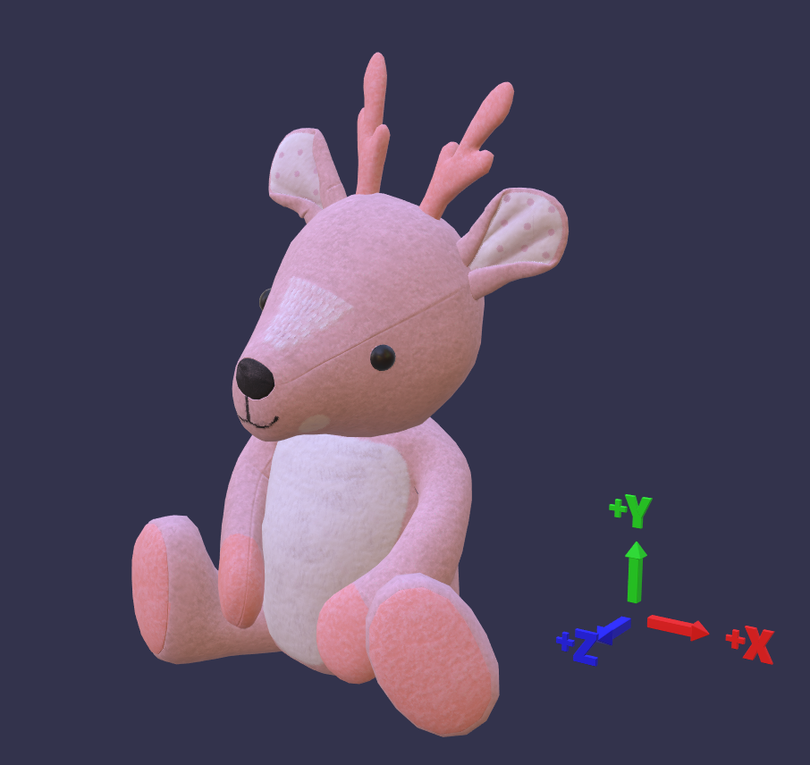

<h1>
Coordinate System and Scale Unit
</h1>

<h2>World up, front, and scale units</h2>

Depending on what 3D software you use, each software comes with a different interpretation of coordinate systems and measurement unit. Some software uses `+Z` axis as world up with right hand coordinate system, while others use `+Y` as world up with left/right hand coordinate system. It also matters whether the software uses right-hand or left-hand coordinate system. For scale units, there may be differences based on specific workflows, or default scale unit defined by the software - inch, centimeter, or meter-based unit, etc.

It is typical that we may need to deal with a number of different coordinate systems and scale units during production process. Luckily, when converting to runtime file formats glTF and USDZ, both formats do have standardized settings the assets need to comply with._Both glTF and USDZ use `+Y` world up, `+Z` world front, right-hand coordinate system, and both are meter-based scale standard.

<a href="https://github.com/KhronosGroup/glTF/tree/master/specification/2.0#coordinate-system-and-units">
    <h2>
        <ins>glTF 2.0</ins>
    </h2>
</a>

For more details regarding glTF2.0 specifications:
 [https://github.com/KhronosGroup/glTF/tree/master/specification/2.0](https://github.com/KhronosGroup/glTF/tree/master/specification/2.0)

<h3>Coordinate System and Units</h3>

glTF uses a **right-handed** coordinate system, that is, the cross product of `+X` and `+Y` yields `+Z`. In glTF `+Y` is world up, and the front of a glTF asset faces `+Z`. The units for all linear distances are meters. All angles are in radians and positive rotation is counterclockwise.

  

<h3>Normal Maps and glTF</h3>

According to the GLTF2.0 specifications, the normal vectors use OpenGL conventions where +X is right and +Y is up. +Z points toward the viewer.

<a href="https://developer.apple.com/documentation/arkit/understanding_world_tracking">
    <h2>
        <ins>USDZ</ins>
    </h2>
</a>

For more details regarding USDZ: [https://graphics.pixar.com/usd/docs/Usdz-File-Format-Specification.html](https://graphics.pixar.com/usd/docs/Usdz-File-Format-Specification.html)

According to Apple ARKit [documentation](https://developer.apple.com/documentation/arkit/understanding_world_tracking), “ARKit uses world and camera coordinate systems following a right-handed convention: the `y-axis` points upward, and (when relevant) the `z-axis` points toward the viewer and the `x-axis` points toward the viewer's right.”

<h3>Normal Maps and USDZ</h3>
In USDz, normal vectors use OpenGL conventions where `+X` is right and `+Y` is up. `+Z` points toward the viewer.

<a href="https://graphics.pixar.com/usd/docs/api/group___usd_geom_up_axis__group.html">
    <h2>
        <ins>USD</ins>
    </h2>
</a>

For more details regarding USD:\
[https://graphics.pixar.com/usd/docs/index.html](https://graphics.pixar.com/usd/docs/index.html)\
[https://graphics.pixar.com/usd/docs/api/group___usd_geom_up_axis__group.html](https://graphics.pixar.com/usd/docs/api/group___usd_geom_up_axis__group.html)

“The stage up axis is encoded as stage metadatum _upAxis_, whose legal values are "Y" and "Z", as represented by UsdGeomTokens->y and UsdGeomTokens->z. Of course, constructing a correct camera view of a scene depends not only on the up axis, but also on the handedness of the coordinate system. Like OpenGL and the fallback for **[<ins>UsdGeomGprim::GetOrientationAttr()</ins>](https://graphics.pixar.com/usd/docs/api/class_usd_geom_gprim.html#ad1f744a16695ab5219dd15c7237eae4f)**, **UsdGeom stipulates a right-handed coordinate system.** Therefore, when viewing a **[<ins>UsdStage</ins>](https://graphics.pixar.com/usd/docs/api/class_usd_stage.html)** with a "Y" up axis, the stage's Z axis will be pointing out of the screen, and when viewing a **[<ins>UsdStage</ins>](https://graphics.pixar.com/usd/docs/api/class_usd_stage.html)** with a "Z" up axis, the stage's Y axis will be pointing into the screen.”

In summary, here are some high-level take-away regarding the following formats:

<table>
  <tr>
   <td><strong>Format</strong>
   </td>
   <td><strong>glTF</strong>
   </td>
   <td><strong>USDZ</strong>
   </td>
   <td><strong>USD</strong>
   </td>
  </tr>
  <tr>
   <td><strong>Coordinate System</strong>
   </td>
   <td> right-handed
   </td>
   <td> right-handed
   </td>
   <td> right-handed
   </td>
  </tr>
  <tr>
   <td><strong>World Up</strong>
   </td>
   <td>+Y
   </td>
   <td>+Y
   </td>
   <td>+Y or +Z
   </td>
  </tr>
  <tr>
   <td><strong>World Front</strong>
   </td>
   <td>+Z
   </td>
   <td>+Z
   </td>
   <td>+Z or +Y
   </td>
  </tr>
  <tr>
   <td><strong>Scale Unit</strong>
   </td>
   <td>Meter
   </td>
   <td>Meter

(metersPerUnit = meter, else centimeter)
   </td>
   <td>Meter

(Stage-level metadata that encodes a scene's linear unit of measure as meters per encoded unit.)
   </td>
  </tr>
</table>

