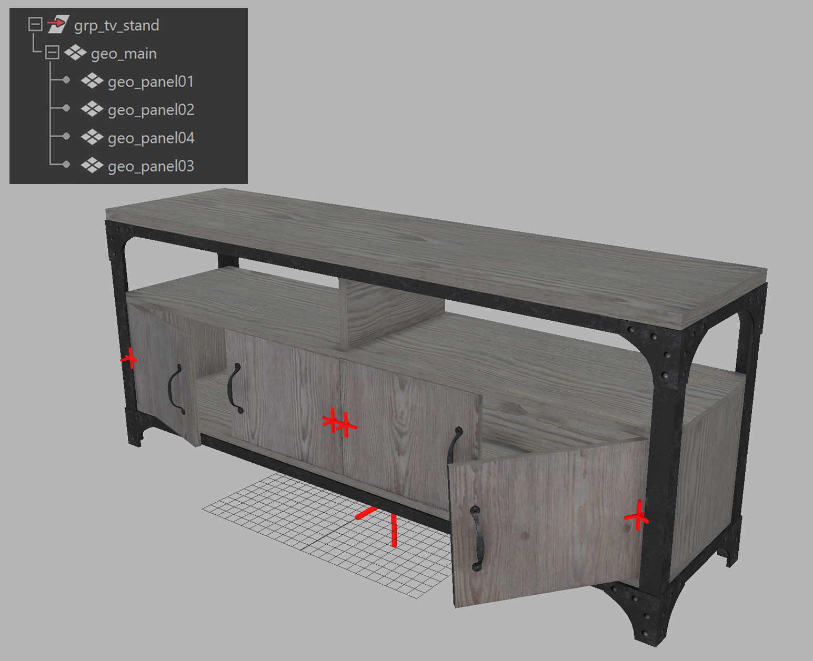
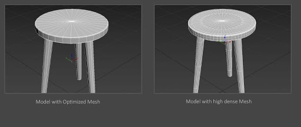
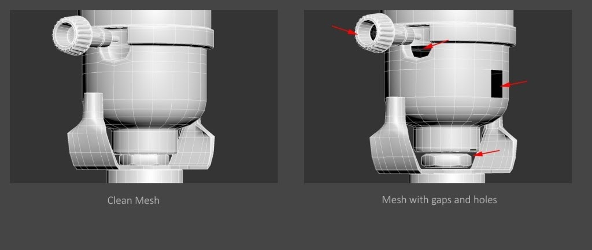
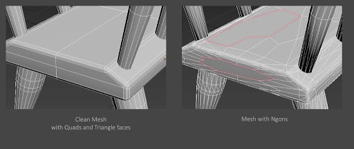
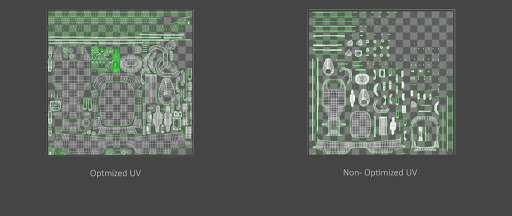
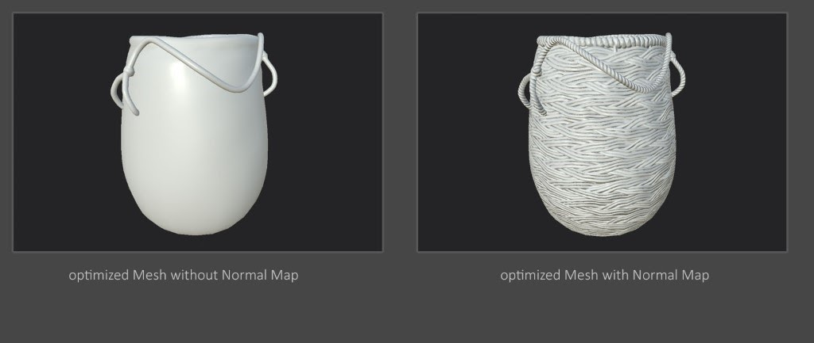
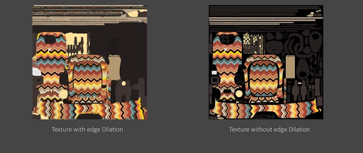
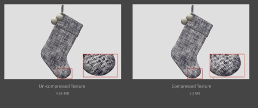
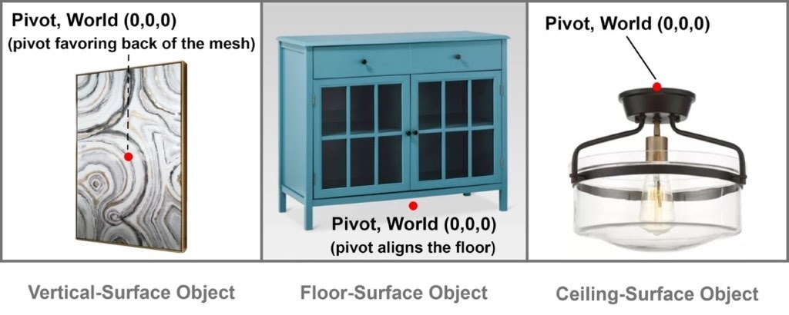

<h1>
File Formats and Asset Structure
</h1>

<h2>
  Best Practice for File Size
</h2>

* The file size is usually composed of geometry and textures. In the runtime asset scenario, usually the textures tend to hold more percentage of the total file size. It’s desirable to have the asset file size as small as possible, which helps in reducing download time and creating smoother guest experience. Ultimately it’s a balancing act between maintaining small file size versus pristine visual quality. 
* With the advancement of hardware capability, more powerful platforms and faster transmission speed, the definition of ideal file size changes over time. Across the industry, our observation is that the standard range for runtime assets vary from 3 MB to 15 MB.
* It is also recommended to use compressed textures to keep the texture size to optimum, for instance, using JPG or compressed PNG. See the Christmas stockings image below as an example. In the near future, the new GPU textures such as KTX2 will be part of the toolings to handle the texture part of asset consideration.

<h2>
Best Practice for Asset Preparation
</h2>

<h3>
Asset Anatomy
</h3>

* **Clean/ Freeze transform data:** During the modeling process or converting the asset across different DCC tools, there may be remnant transform data (rotation, translation and scale). Cleaning up the transform data helps ensure reliable behaviour, and is critical for animation.
* **Grouping/Hierarchy:** proper grouping hierarchy (scene graph) to organize components of a model to be a self-contained asset
* **Consistent naming convention:** consistent naming for the components (group nodes, materials, meshes, etc.) with proper prefixes and suffixes
* **Pivot placement for each component:** place the pivot points of meshes and group nodes with intention. Place the pivots where the hinges are for movement control, for instance. Otherwise, it’s recommended to place the pivots of the group nodes or meshes all at the world center `(0,0,0)`. The top group node of the asset should be placed at world `(0,0,0)`.

To better illustrate the point, here’s an example of a TV shelf and how it is prepared.

* Scene graph of the TV Stand model: it has a top group node which includes several geometry components.
* The scene graph illustrates the consistent naming rule that describes the components and the asset itself. 
* The red axes visualize where the pivot points are for the cabinet doors, easier of animation/ movement. The asset main pivot point (the big red aexis) is at the world center `(0,0,0)`

  

* How to use polygons economically to best describe the shape and form is the goal. A nice topology flow is always desired.

  

* Water-tight geometry without gaps or holes are usually desired for runtime asset creation scenarios. It is because that the water-tight asset provides better optimization through reprocessing in some optimization programs, or simply to avoid the need to turn on double-sided rendering.

  

* Avoid N-gons and non-planar faces, only use Quad mesh or Triangle meshes. It’s recommended to avoid long- thin triangular faces, as it would be more expensive to draw in GPU.

  

*   UV layout in a 0-to-1 space, should maximize texture space as possible

  

<h3>
Asset Textures
</h3>

* Another common and effective practice to reduce the polygon mesh is to bake the detailed high-poly mesh to normal map and apply it to a lower-density mesh to reduce the vertex count

  

* To avoid visible seams around the UV border in an asset, textures should have edge dilation to avoid seams during MIP mapping 

  

* Use compressed textures (e.g. JPEG) to keep file size smaller; or use PNG if alpha information is required (e.g. albedo texture with transparency information).

  

* Dealing with opaque and transparent components in an asset - It is preferred to use separate materials to describe transparent and opaque objects.
* It is always good to consider and design your assets based on the targeted viewers. It is critical to understand what format features (e.g.  glTF 2.0) may or may not be supported at this moment -- like vertex color, extra uv sets,  animation, cameras, etc.

<h3>
Asset Pivot Point (Placement, hanging points)
</h3>

  

The pivot of a 3D asset represents where its resting position is, and where its virtual handle will be, when the asset is instantiated in an interactive environment. It really depends on your specific targeted platforms and certain custom requirements. However, there is still a general rule of thumb and common practice we would recommend:

* Place the pivot as the asset’s resting position
* Place the pivot at the center of the volume, and favor the hypothetical contacting plane:
   * Favoring the contact point against the vertical wall
   * Favoring the floor if it’s a floor bound object
   * Favoring the top of the object if the asset if design for ceiling space
* Place the asset at the center of the world space `(0,0,0)`

<h2>
General Naming Convention Best Practice
</h2>

1. Valid charset for naming assets and files: `a-z`, `_`, `-`, `0–9`
2. Start file names with a lowercase letter. Avoid starting a file name with a number, an underscore `_`, a hyphen `-`, or any other special characters.
   * Some transcoding tools may crash if the beginning of the file name is not a lower case letter.
3. Avoid using capital letters or spaces in file names and extensions. 
    * Some OS (Unix and Linux) and tools, as well as web environment tend to be case-sensitive. 
    * Websites hosted on Unix type servers tend to be case-sensitive as their underlying file systems are typically case-sensitive. 
    * Websites hosted on Windows tend to be case-insensitive because the underlying file system is case-insensitive. 
    * Consistency is essential, so keep names in lowercase. However, camel case would be an acceptable way to use capital letters.
4. Use `_` (underscore ), `-` (hyphen) to separate different words. 
5. For file names, we recommend not using camel case, even though a common practice in programming.

It is always great practice to define the appropriate naming conventions for different elements in the scene. The consistency can help to give clarity for other artists or users, especially in a team environment. Another benefit would be the consistent naming can help automated engineering solution. 

Below is an example  of some common industry standard naming prefixes to define different elements in the file

Element | Prefix | Example
---|---|---
**object group** | grp | grp_chair
**geometry** | geo | geo_chair
**material** | mat | mat_ wood
**opaque** | opq | mat_opq_wood
**transparency** | trp | mat_trp_glass
