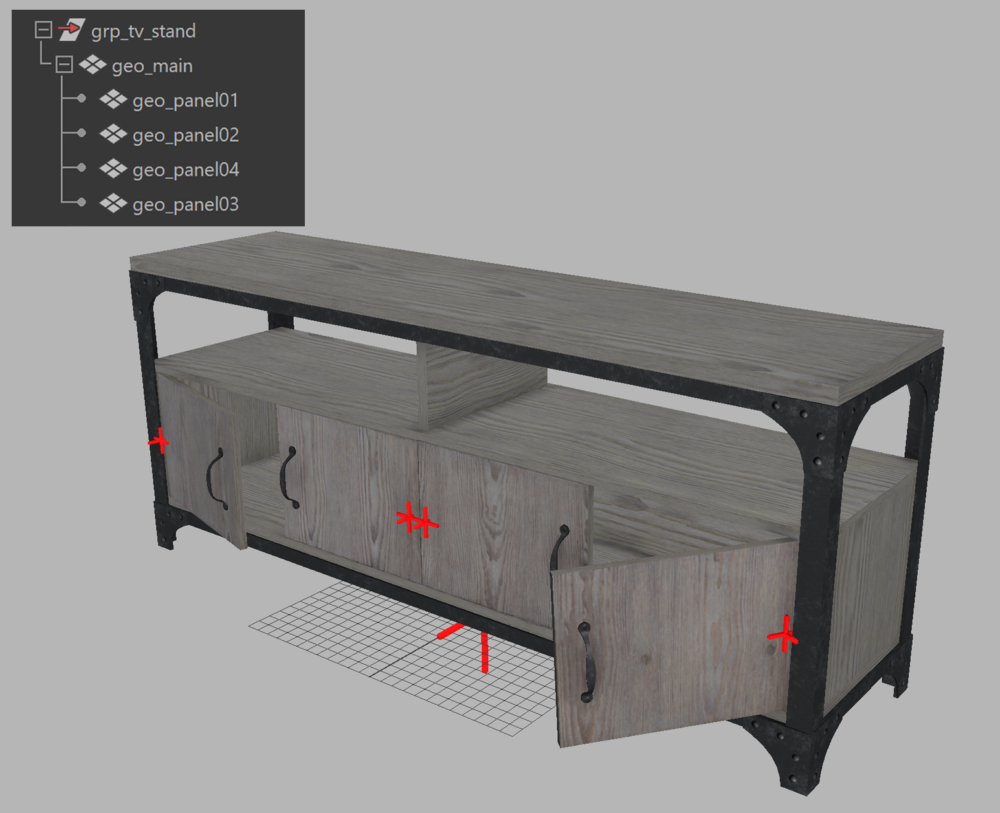
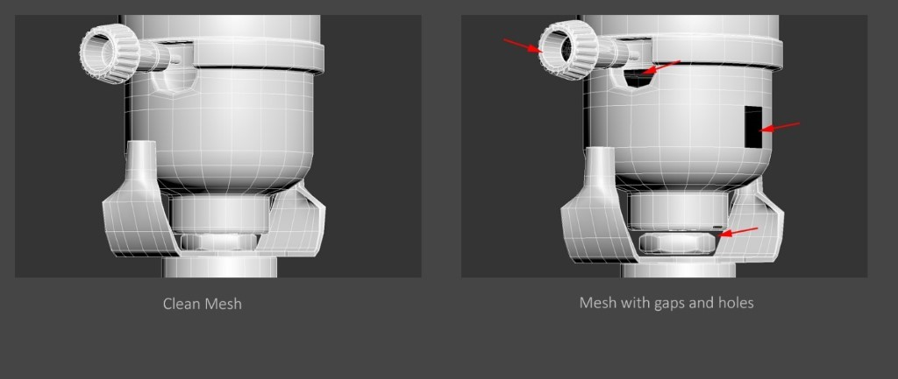
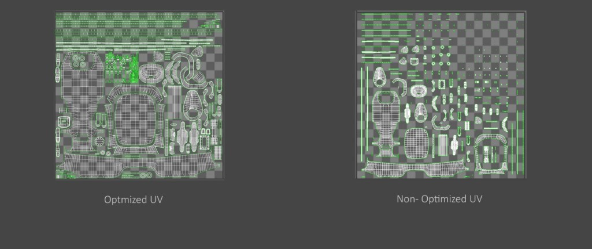
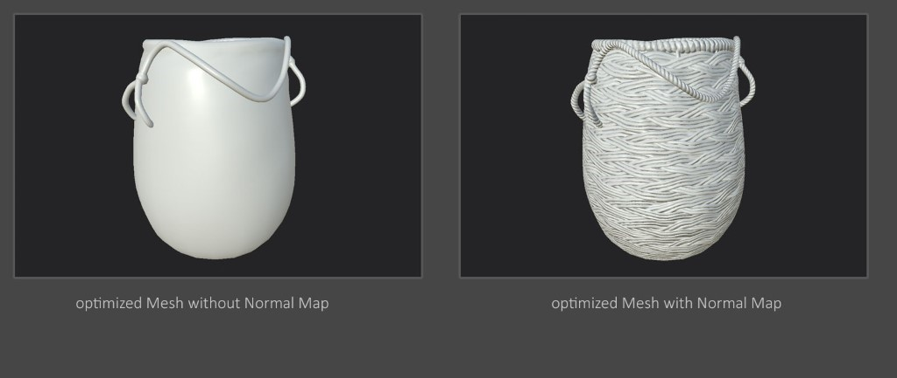
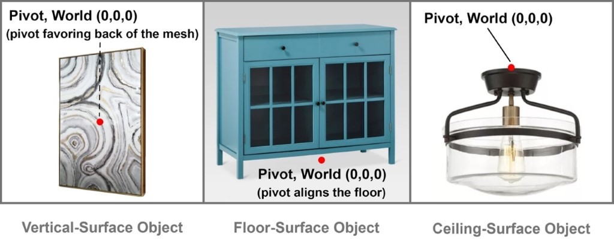

# File Format and Asset Structure

*Version 1.0.0*\
Last Updated: October 20, 2020

[<ins>Return to <em>Asset Creation Guidelines Summary</em></ins>](./asset-creation-guidelines/RealtimeAssetCreationGuidelines.md)

When building 3D assets, it is important to export the final product models into widely recognized file formats and to structure data within those files using common conventions.

glTF is a royalty-free, open standard file format for 3D assets that is widely adopted by 3D authoring tools and viewers on diverse platforms. glTF enables asset materials to use Physically Based Rendering (PBR) for realistic visual product representations. glTF assets are represented as .gltf files with referenced textures & geometry, or binary .glb files that embed the textures directly instead of referencing them as external images.

iOS devices do not natively support glTF but use Apple's proprietary USDz format. glTF and USDz have similar capabilities but some glTF features are not supported by USDz. For details please refer to the section - glTF 2.0 Features / Extensions & USDZ Comparison.

To support these differences we recommend using the Publishing Targets workflow. Using this system a Source Asset is created with the highest quality content in PBR format. This asset can then be decimated/simplified into different targets, to support a variety of viewers, each supporting different material features. For example, glTF supports the use of an Emissive value or texture, whereas USDz only supports an Emissive texture.

## Best Practice for File Size

*   The file size is usually composed of geometry and textures. In the runtime asset scenario, usually the textures tend to hold more percentage of the total file size. It’s desirable to have the asset file size as small as possible, which helps in reducing download time and creating smoother guest experience. Ultimately it’s a balancing act between maintaining small file size versus optimal visual quality. 
*   With the advancement of hardware capability, more powerful platforms and faster transmission speed, the definition of ideal file size changes over time. Across the industry, our observation is that the standard range for runtime assets vary from 3 MB to 15 MB.
*   It is also recommended to use compressed textures to keep the texture size to optimum, for instance, using JPG or compressed PNG. See the Christmas stockings image below as an example. In the near future, the new GPU textures such as KTX2 will be part of the toolings to handle the texture part of asset consideration.
*   See Publishing Targets section.

## Best Practice for Asset Preparation 

### Asset Anatomy

*   **Clean/ Freeze transform data:** During the modeling process or converting the asset across different DCC tools, there may be remnant transform data (rotation, translation and scale). Cleaning up the transform data helps ensure reliable behaviour, and is critical for animation.
*   **Grouping/Hierarchy**: proper grouping hierarchy (scene graph) to organize components of a model to be a self-contained asset
*   **Consistent naming convention**: consistent naming for the components (group nodes, materials, meshes, etc.) with proper prefixes and suffixes
*   **Pivot placement** for each component: place the pivot points of meshes and group nodes with intention. Place the pivots where the hinges are for movement control, for instance. Otherwise, it’s recommended to place the pivots of the group nodes or meshes all at the world center `(0,0,0)`. The top group node of the asset should be placed at world `(0,0,0)`. To better illustrate the point, here’s an example of a TV shelf and how it is prepared (Figure 1.1).

    *   Scene graph of the TV Stand model: it has a top group node which includes several geometry components.
    *   The scene graph illustrates the consistent naming rule that describes the components and the asset itself. 
    *   The red axes visualize where the pivot points are for the cabinet doors, easier of animation/ movement. The asset main pivot point (the big red aexis) is at the world center `(0,0,0)`

    (C)2020, Target. License: CC BY 4.0 International
    Figure 1.1: pivot placement

### Asset Geometry

*   How to use polygons economically to best describe the shape and form is the goal. A nice topology flow is always desired (Figure 1.2).

    (C)2020, Target. License: CC BY 4.0 International
    Figure 1.2: geometry and topology flow

*   Water-tight geometry without gaps or holes are usually desired for runtime asset creation scenarios. It is because that the water-tight asset provides better optimization through reprocessing in some optimization programs, or simply to avoid the need to turn on double-sided rendering (Figure 1.3).

    (C)2020, Target. License: CC BY 4.0 International
    Figure 1.3: water-tight geometry

*   Avoid N-gons and non-planar faces, only use Quad mesh or Triangle meshes. It’s recommended to avoid long- thin triangular faces, as it would be more expensive to draw in GPU (Figure 1.4).

    (C)2020, Target. License: CC BY 4.0 International
    Figure 1.4: avoid N-gons and non-planar faces

*   UV layout in a 0-to-1 space, should maximize texture space as possible (Figure 1.5)

    (C)2020, Target. License: CC BY 4.0 International
    Figure 1.5: maximize texture space in UV layout

### Asset Textures

*   Another common and effective practice to reduce the polygon mesh is to bake the detailed high-poly mesh to normal map and apply it to a lower-density mesh to reduce the vertex count (Figure 1.6)

    (C)2020, Target. License: CC BY 4.0 International
    Figure 1.6: use of normal map to describe details

*   To avoid visible seams around the UV border in an asset, textures should have edge dilation to avoid seams during MIP mapping (Figure 1.7)

    (C)2020, Target. License: CC BY 4.0 International
    Figure 1.7: maximize texture space in UV layout

*   Use compressed textures (e.g. JPEG) to keep file size smaller; or use PNG if alpha information is required - e.g. Base Color texture with Alpha Coverage information (Figure 1.8).

    (C)2020, Target. License: CC BY 4.0 International
    Figure 1.8: optimize textures with compression

*   Dealing with opaque and transparent components in an asset - It is preferred to use separate materials to describe transparent and opaque objects. 
*   It is always good to consider and design your assets based on the targeted viewers. It is critical to understand what format features (e.g.  glTF 2.0) may or may not be supported at this moment -- like vertex color, extra uv sets,  animation, cameras, etc. 

### Asset Pivot Point (Placement, hanging points)

    (C)2020, Target. License: CC BY 4.0 International
    Figure 1.9: asset pivot point placement

The pivot of a 3D asset represents where its resting position is, and where its virtual handle will be, when the asset is instantiated in an interactive environment. It really depends on your specific targeted platforms and certain custom requirements (Figure 1.9). However, there is still a general rule of thumb and common practice we would recommend:

*   Place the pivot as the asset’s resting position
*   Place the pivot at the center of the volume, and favor the hypothetical contacting plane:
    *   Favoring the contact point against the vertical wall
    *   Favoring the floor if it’s a floor bound object
    *   Favoring the top of the object if the asset if design for ceiling space
*   Place the asset at the center of the world space `(0,0,0)`

## General Naming Convention Best Practice

* Use valid character sets for asset and file naming: `a-z`, `_`, `-`, `0–9`. 
    *   For naming convention, start the first character with alphabet letters only.
    *   Use camel case, underscore `_` or hyphen `-` to separate words within a file name, rather than blanks.
    *   Consistency is essential, Some OS (Unix and Linux) and tools and web environments tend to be case-sensitive. 

It is always great practice to define the appropriate naming conventions for different elements in the scene. The consistency can help to give clarity for other artists or users, especially in a team environment. Another benefit would be the consistent naming can help automated engineering solutions. 

Below is an example  of some common industry standard naming prefixes to define different elements in the file 

| Element  | Prefix | Example |
|--- |--- |--- |
|object group|grp|grp_chair|
|geometry|geo|geo_chair|
|material|mat|mat_ wood|
|opaque|opq|mat_opq_wood|
|transparency|trp|mat_trp_glass|
|texture|tex|tex_wood|

  

[<ins>Return to <em>Asset Creation Guidelines Summary</em></ins>](./asset-creation-guidelines/RealtimeAssetCreationGuidelines.md)
