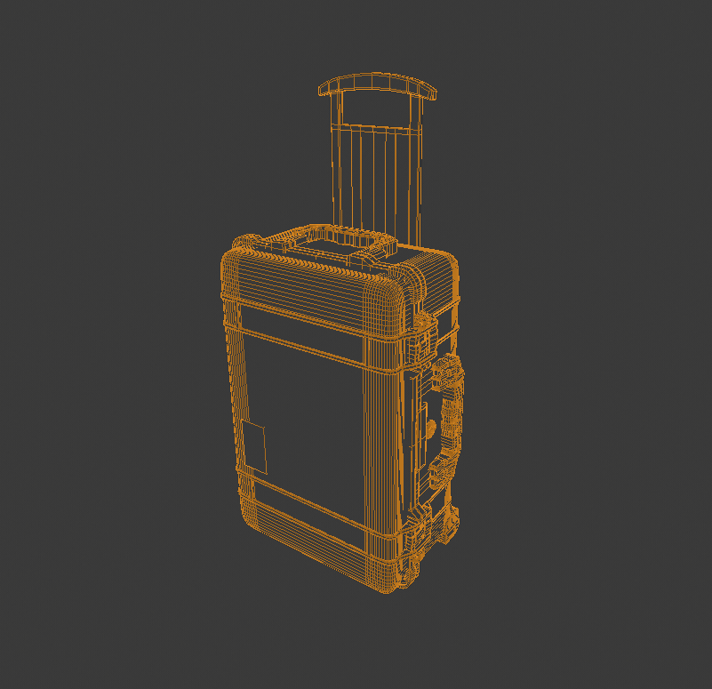
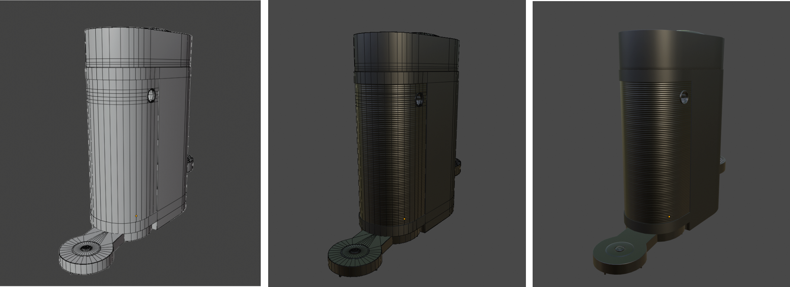
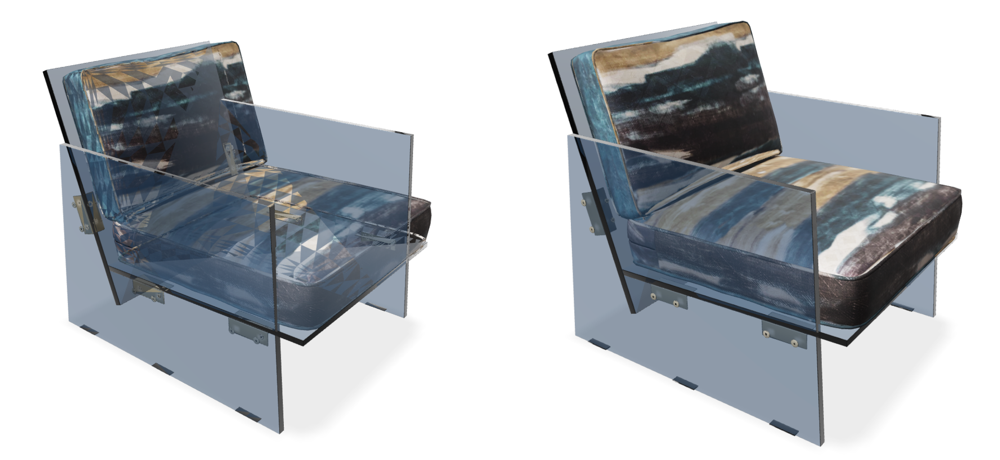
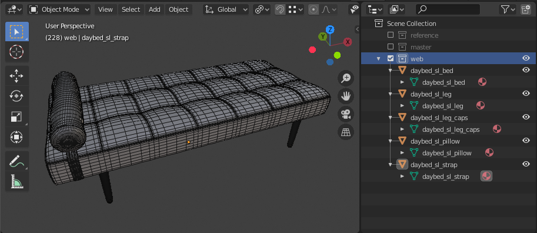

# Geometry

*Version 1.0.0*\
Last Updated: October 20, 2020

[<ins>Return to <em>Asset Creation Guidelines Summary</em></ins>](./asset-creation-guidelines/RealtimeAssetCreationGuidelines.md)

A geometric mesh is a structural build of a 3D model that is created using a combination of polygons. They help define the size and shape of a model. 

    (C)2020, 3XR Inc. License: CC BY 4.0 International
    Figure 3.1: Wireframe model of a modern vacuum. 

It is best to design 3D models with high accuracy and quality, which can then be tailored for product rendering, or later optimized as real-time assets for real-time applications. To function on the web and mobile devices, it is important to ensure that models load quickly and that they are highly optimized. If a model is not made efficiently, it can dramatically impact the experience downstream.

## Reference

Photorealistic models should look identical to the original product in reality. Having and using reference photos from many angles as well as product measurements, helps ensure that a model will be as accurate as possible.

    (C)2020, 3XR Inc. License: CC BY 4.0 International
    Figure 3.2: Piano Geometry & Reference Photos. 

Make sure models are built to real world scale, so they can be used immediately without having any scaling issues. If a model is not properly scaled, it can interfere with its surroundings or not function properly. Keep in mind that current GLTF/USDZ converters and exporters sometimes rely on having 3D models being set up in meters. Be sure to understand what your exporter is doing to your model regarding scale once completed and before implementation.

## Quads & Tris 

### 

    (C)2020, 3XR Inc. License: CC BY 4.0 International
    Figure 3.3: Quad Geometry vs Triangle Geometry. 

The geometry of a model is represented by vertices, which are points in 3D space, that are connected by edges. Those edges form faces that can either be 3 sided (tris) or 4 sided (quads). 4 sided quads are not actually supported in GLTF and will throw a warning on submission. It is recommended that you use quads while creating your model and using this mesh as your main source. Leave triangulation of your object to be the last step of model creation. Some software allows for faces with more than 5 sides (n-gons), but n-gons are **not recommended** because there can be some ambivalence as to how they get drawn in the viewer.

When models are rendered in a viewer, each triangle that is visible on the screen gets painted using information in the texture maps. Models that have quads are split in half into triangles during rendering, so it is the triangle count of the model that impacts performance.

## Topology & Mesh Optimization 

When creating a model, a mesh should strive to use every polygon in an efficient manner. 

Topology is the organization, flow, and structure of the polygons of a 3D model. It is how each vertice, edge, and face are set up in order to create a model. 

Every model should have proper topology to minimize the visual errors that it would have in the viewer. Single vertex points that have a large number of edges connected to them should be avoided when possible. 

    (C)2020, 3XR Inc. License: CC BY 4.0 International
    Figure 3.4: Main source mesh topology on a couch model.

There should be no black polygons on the model. Black polygons are a sign that something has gone wrong with the model, such as two faces overlapping or normals need to be recalculated. In some software, this kind of error can appear as part of a mesh looking “inside-out” or not showing up at all on the mesh. 

	

Bevel all product edges to smooth out edge transitions. There are no perfectly pointed edges in everyday life and your model should reflect this. A model that has a too little number of polygons on a normally very rounded edge can seem unrealistically sharp.

## 

    (C)2020, 3XR Inc. License: CC BY 4.0 International
    Figure 3.5: Coffee maker body is too polygonally sharp without more edges added.

## Mesh Optimization  Workflow : how to optimize a model

    (C)2020, 3XR Inc. License: CC BY 4.0 International
    Figure 3.6: Individual components modeled, then constructed together.

Create 3D models as if you were building the real product. We do not advise creating a very complex model from a singular mesh. Model all the individual pieces of a model separately. 

## Polygonal Count

Models should only have as much geometry as necessary to keep a high level of realism. The more triangles, the more calculations that need to be computed when rendering. Normal map textures should be used to capture small details that may be modeled in a [base asset](https://docs.google.com/document/d/1UfUJpDPDOk35kGxZ_vuJhPPQxXt_gtSBDt99ogEDhFQ/edit#heading=h.q4349om3p379) in order to reduce the triangle count while retaining visual fidelity. 

For further information about specific publishing targets, refer to the [Publishing Targets](https://docs.google.com/document/d/1UfUJpDPDOk35kGxZ_vuJhPPQxXt_gtSBDt99ogEDhFQ/edit#heading=h.fjjg1oxve2by) section of this document. 

## Normal Maps

Normal maps may be used to approximate 3 dimensional surface details during rendering without requiring actual geometry to interact with scene lighting. Compared to using face or vertex based normals to calculate light interaction, which is limited to the density of the mesh being rendered, a normal map represents normal data on a surface by storing normal vectors in the RGB channels of a bitmap that is mapped on the same surface. The result is an ability to store normal data at a much higher resolution, limited only by bitmap pixel resolution. \

    (C)2020, 3XR Inc. License: CC BY 4.0 International
    Figure 3.7: Normal map used to create ridges at the back of a coffee machine.

Same asset high/low res example 

 Workflow: How to make normal maps..

See [bump texture](https://docs.google.com/document/d/1UfUJpDPDOk35kGxZ_vuJhPPQxXt_gtSBDt99ogEDhFQ/edit#heading=h.oizqf7mv5066) in materials section

See normal map considerations for [glTF](https://docs.google.com/document/d/1UfUJpDPDOk35kGxZ_vuJhPPQxXt_gtSBDt99ogEDhFQ/edit#heading=h.43rpgtp75mkv) and [USD](https://docs.google.com/document/d/1UfUJpDPDOk35kGxZ_vuJhPPQxXt_gtSBDt99ogEDhFQ/edit#heading=h.q0tdnsizpo8u) formats

Ideally we would take into account all the considerations in this article. Needs coordination with certification. [https://medium.com/@bgolus/generating-perfect-normal-maps-for-unity-f929e673fc57](https://medium.com/@bgolus/generating-perfect-normal-maps-for-unity-f929e673fc57)

## Platform-Based LODs

Mobile web-based augmented reality should have the most optimized 3D models as compared to virtual reality models. The more powerful a machine is to process your model, the greater the file size of your model can be. When creating models of a product, it is best to follow best to produce an accurate, high-quality model that can account for being used in various platforms. For further information on LODs and what they are, refer to the [LODs](https://docs.google.com/document/d/1UfUJpDPDOk35kGxZ_vuJhPPQxXt_gtSBDt99ogEDhFQ/edit#heading=h.w1ugjglk6m58) section of this document.

For further information about specific recommended publishing targets, refer to the [Publishing Targets](https://docs.google.com/document/d/1UfUJpDPDOk35kGxZ_vuJhPPQxXt_gtSBDt99ogEDhFQ/edit#heading=h.fjjg1oxve2by) section of this document.

## Separate vs. Combined Meshes

### Opaque vs. Transparencies

Sections of models that have transparencies should have information in the alpha channel of a corresponding PNG diffuse texture. JPG images are not able to retain alpha channel information and will not work.

### Multi-Mesh Application

There is artifacting that can occur when a model has transparent components and is combined into one object. Having multiple materials and meshes can often be used to prevent artifacting in current AR viewers due to this. 

    (C)2020, 3XR Inc. License: CC BY 4.0 International
    Figure 3.8: Left: Model with combined materials & meshes  |  Right: Model with separated materials & meshes.

A multi-mesh object can also provide more clarity to the components of a model, giving the model more labelled information.

    (C)2020, 3XR Inc. License: CC BY 4.0 International
    Figure 3.9: Daybed model separated by different mesh components.

## Watertight vs. Open Mesh Geometry

In its general context, watertight geometry refers to when a model’s mesh has no holes or gaps on its surface. The mesh on all of the surfaces is complete and the mesh is made of valid elements that are properly connected. 

### Considerations for When to Use It

For the most part, most cases of models should be using watertight meshes to comply with current industry standard practices of modeling. However, open mesh geometry can be used if the open facing mesh is hidden and covered inside of another mesh. This would be considered non-manifold geometry and not a best practice, but you would be able to save on the number of polygons your overall model would have if needed.

### What It Impacts or Problems to Be Aware Of

Open mesh geometry is non-manifold geometry and in some applications, this may cause errors during implementation. For the most part, this is not problematic as long as there are no holes or gaps shown on the exterior of your model. 

## One-Sided vs. Double-Sided Mesh

Backface culling occurs when a one sided mesh is viewed from the other side. Our recommendation is that if the back of a polygon is seen at all in the model, that it should have a thickness to it to avoid having this backface culling problem. 

Ensure that any area of a model that can be seen, even through glass, has thickness to it. This will prevent artifacting from occurring and is the case for most common AR viewers. Without the extra geometry added, most viewers would render this as if a piece of the mesh is missing and will break the illusion that the product is real.

## 

    (C)2020, 3XR Inc. License: CC BY 4.0 International
    Figure 3.10: Container with transparent lid needs inner geometry since it will be seen in the AR viewer.

## Best Practice

*   A model should sit on the origin point (0,0,0) with real world sizing
*   The opaque and transparent components need to be on separate meshes and have a separate material
*   The pivots of the separate meshes need to be properly positioned and grouped
*   Avoid nGons where possible
*   Transform information: Freeze/ clean the model so it has clean transformation data (position and rotation) clean with (0,0,0).

  

[<ins>Return to <em>Asset Creation Guidelines Summary</em></ins>](./asset-creation-guidelines/RealtimeAssetCreationGuidelines.md)