# Materials & Textures

*Version 1.0.0*\
Last Updated: October 20, 2020

[<ins>Return to <em>Asset Creation Guidelines Summary</em></ins>](/asset-creation-guidelines/RealtimeAssetCreationGuidelines.md)

Materials are used to add visual details and shading to the flat surfaces of a 3D model. They help define whether the surface looks like wood, fabric, metal, plastic, glass, etc.

The same material can be reused on as many models as you wish. A furniture supplier may use the same dark oak wood stain for a line of home furnishings; the look of this surface can be defined in a single material that is reused on all their 3D models. This creates a consistent look, and reduces rework.

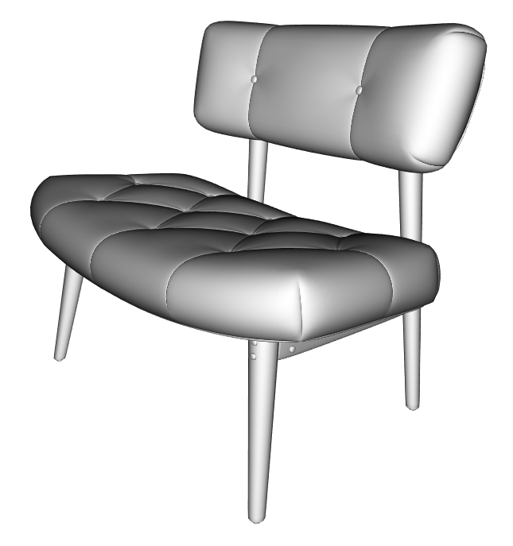

    (C)2020, Wayfair. License: CC BY 4.0 International
    Figure 5.1: A model with a default material

    (C)2020, Wayfair. License: CC BY 4.0 International
    Figure 5.2: The same model with customized materials

## Material Types

There are a few material types to use for real-time 3D models in e-commerce applications. 

*   PBR Metallic-Roughness
*   PBR Specular-Glossiness
*   Diffuse-Specular
*   Unlit
*   Custom shaders

## PBR Materials

PBR stands for Physically Based Rendering. PBR is an approach for materials and rendering that creates accurate and predictable results in varying lighting conditions (sunlight, indoor lighting, night time, etc).

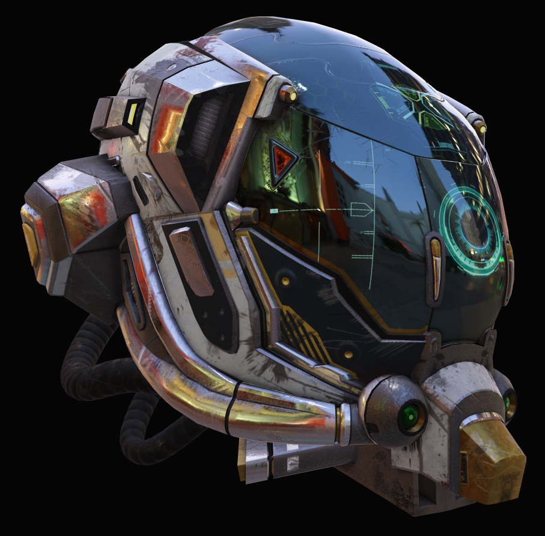

    (C)2016, [theblueturtle_](https://sketchfab.com/theblueturtle_). License: CC BY 4.0 International
    Figure 5.3: Battle Damaged Sci-fi Helmet - PBR. glTF demo: https://www.babylonjs.com/demos/pbrglossy/

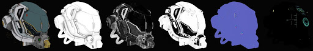

    (C)2016, [theblueturtle_](https://sketchfab.com/theblueturtle_). License: CC BY 4.0 International
    Figure 5.4: PBR textures (from left): Base Color, Occlusion, Roughness, Metalness, Normal, Emissive

## PBR Metalness-Roughness

For most surfaces we recommend using a PBR Metalness-Roughness material. 

It allows a wide range of surface types, is easy to use and understand, keeps file sizes smaller for downloads, and uses less memory when rendering.

    (C)2020, Wayfair. License: CC BY 4.0 International
    Figure 5.5: PBR Metallic-Roughness material

## PBR Specular-Glossiness

If the reflectivity of a surface cannot be created properly with PBR Metalness-Roughness, then you may need to use PBR Specular-Glossiness instead. 

PBR Specular-Glossiness offers more control for reflection color, at the expense of using more memory and increasing the model file size. 

PBR Specular-Glossiness has two key advantages over Metalness-Roughness:
1. It can create colored reflections on non-metal surfaces
1. It can prevent texture artifacts where metals transition to non-metals

    (C)2020, Wayfair. License: CC BY 4.0 International
    Figure 5.6: Satin fabric is a non-metallic surface that relies on colored reflections. Without colored reflection (left), versus with colored reflection

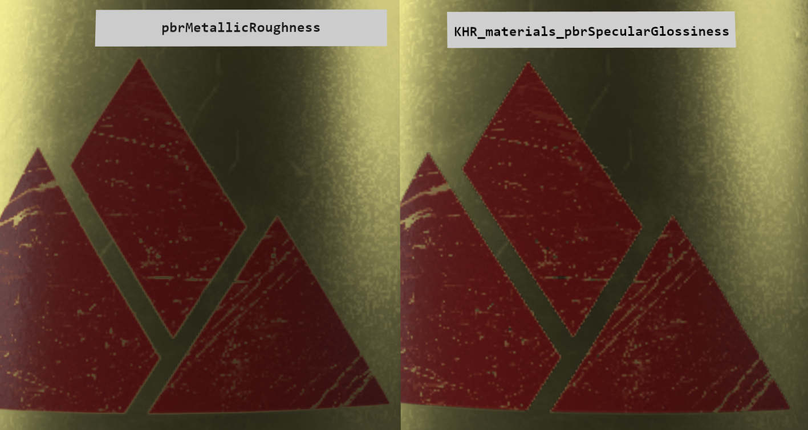

    Image by Microsoft, based on the Water Bottle sample model. License: Public Domain
    Figure 5.7: The PBR Metalness-Roughness material can cause fringing artifacts between metals and non-metals. On the left, the edges of the red label show fringe artifacts between the red paint and the brass metal. On the right, the PBR Specular-Glossiness material doesn’t show these errors

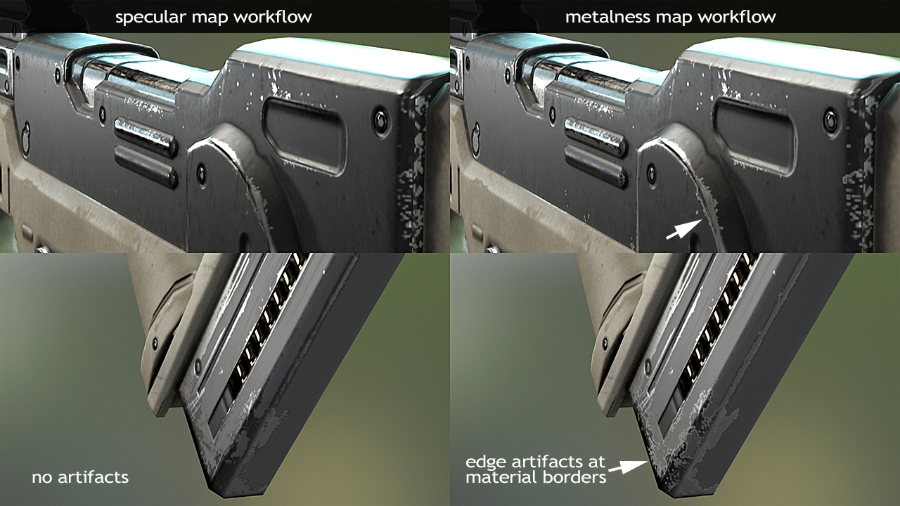

    (C)2020, Joe Wilson. License: CC BY 4.0 International
    Figure 5.8: Another example of transition artifacts caused by a Metalness texture

## Diffuse-Specular Material

This is an older non-PBR material type, in common use before PBR workflows became commonplace. If an asset uses this material type, we recommend to convert the material into a PBR Metalness Roughness material.

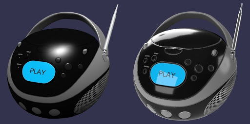

    Image by Microsoft, based on the Boom Box sample model. License: Public Domain
    Figure 5.9: Diffuse-Specular (left), versus PBR Metalness-Roughness. Model by Microsoft, Diffuse-Specular conversion by Gary Hsu.

Diffuse-Specular does not use accurate lighting, so the common workflow was to paint lighting and shading information into the Diffuse texture. Baked-in lighting can give surfaces more depth, at the expense of looking incorrect when the model is loaded in scenes with different lighting.

When using a PBR material, ambient occlusion is kept separate from the Base Color texture, so it can be applied only to soft diffuse lighting but not to dynamic lighting. This gives a more realistic result. Diffuse-Specular lacks this separation, so ambient occlusion is often painted into the Diffuse texture which can cause a “dirty” looking surface.

    (C)2020, Wayfair. License: CC BY 4.0 International
    Figure 5.10: Textures with shading can cause the model to look dirty (left). PBR models should use un-shaded textures (right)

## Unlit Material

Unlit forces the surface to not be affected by scene lighting. This is not a PBR material type. Dynamic lights and Image-Based Lights will not affect the surface. Base Color will be shown at full strength, without brightening or darkening. 

It is extremely rare for real-world surfaces not to be lit. Even the blackest coal is still affected by lighting. 

Unlit can be useful for specific situations like a drop shadow, or a user interface overlay. 

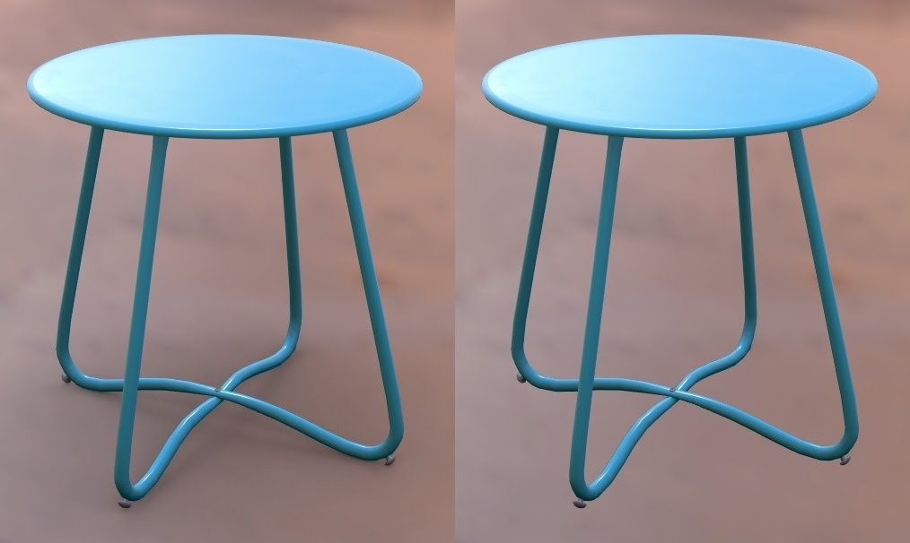

    (C)2020, Wayfair. License: CC BY 4.0 International
    Figure 5.11: A shadow plane using an Unlit material (left) vs. no shadow

We recommend not including a dropshadow in product models, except when a specific situation calls for it. For example, a Facebook AR asset can include a dropshadow that helps indicate to the user when an asset is being lifted to move it across the floor, see [SparkAR: Simple Shadows](https://sparkar.facebook.com/ar-studio/learn/articles/3D/simple-shadows#choosing-an-occluder-object).

## Custom Shaders

We do not recommend using custom shaders for e-commerce models.

Custom shaders could be created for specific use cases, for example to create an animated fire to demonstrate functionality in a fireplace insert product. See the draft extension [KHR_techniques_webgl](https://github.com/KhronosGroup/glTF/tree/master/extensions/2.0/Khronos/KHR_techniques_webgl) which is being developed to allow custom shaders.

Beware, a custom shader may only work predictably in your own website’s 3d viewer. Custom shaders are not guaranteed to render consistently across viewers, and some may not be able to render the model at all. Search engines or advertisers may fail to render the custom shader, preventing your product from being discoverable.

If a custom shader must be used, we recommend you create another LOD (Level of Detail model) with a standard PBR Metalness-Roughness material, so the model can be reliably rendered by other viewers. 

## Multiple Materials per Model 

An asset can either use a single material for the whole model, or else multiple materials can be assigned to different parts of the model. There are tradeoffs between the two approaches.

### Single Material

It is recommended in most cases to use a single material for the entire asset. This reduces the file size, and improves rendering performance. 

When an asset has multiple surface types, for example cloth and wood and metal, then a single material will require all textures to be combined into a UV “atlas” layout. 

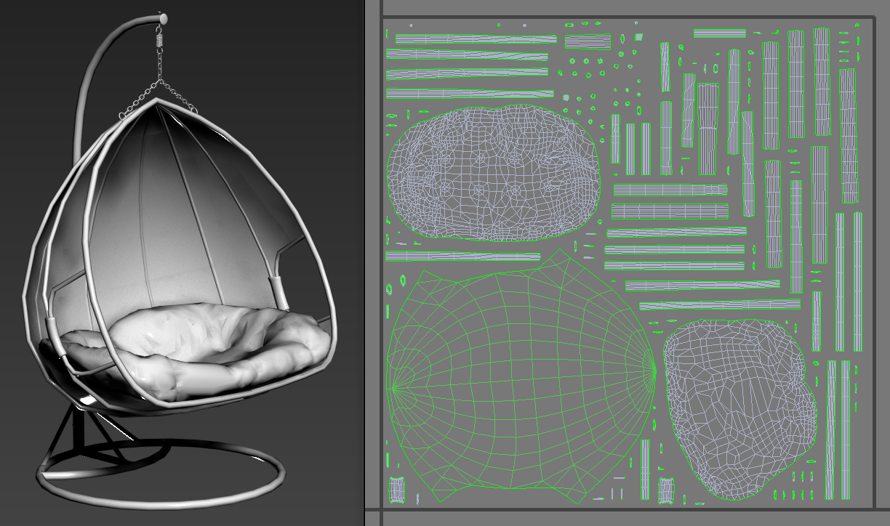

    (C)2020, Wayfair. License: CC BY 4.0 International
    Figure 5.12: UV atlas layout

### Multiple Materials

While it is generally recommended to use a single material, a model can use multiple materials instead when needed. 

There are two common reasons to use multiple materials:
1. Tiled textures
1. Material variants

#### Multiple Materials - Tiled Textures

If blurriness is a concern, then tiled textures can be used. Each tiling texture will need its own material. For example, a chair with wood, metal, and fabric could use three separate materials. 

Note however that real-time rendering performance can be slower with multiple materials because this can increase draw calls.

    (C)2020, Wayfair. License: CC BY 4.0 International
    Figure 5.13a: A real-time model with four materials

    (C)2020, Wayfair. License: CC BY 4.0 International
    Figure 5.13b: The material assignments shown as colors. Red pieces use the fabric material, green uses wood, blue uses metal, and yellow uses the label material

    (C)2020, Wayfair. License: CC BY 4.0 International
    Figure 5.13c: The four materials being used on a chair model, shown in 3ds Max. Image credit: Wayfair.

You should reuse the same material on multiple parts. For example if a chair has 16 metal fasteners, do not use a different material for each. Instead, use a single shared material for all 16 pieces. This will reduce draw calls, which improves real-time rendering speed.

    (C)2020, Wayfair. License: CC BY 4.0 International
    Figure 5. : The same metal material is reused on multiple parts (green highlight for emphasis)

#### Multiple Materials - Material Variants

Multiple materials will also allow the use of the Base Color Factor in a material. This can be used alone for solid-colored surfaces such as simple plastic, or it can colorize a grayscale Base Color texture such as a fabric weave. The color value can be swapped to represent surface variants, while using very small filesizes. 

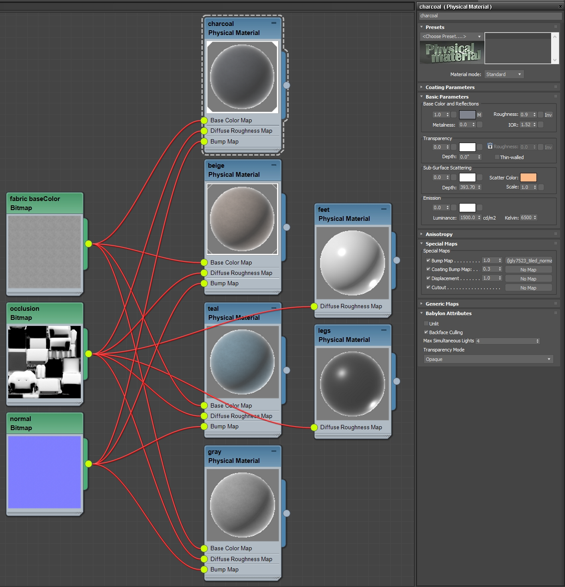

    (C)2020, Wayfair. License: CC BY 4.0 International
    Figure 5.16: Material variants using baseColorFactor to colorize a texture

## Inputs for Real-Time Materials

    (C)2020, Wayfair. License: CC BY 4.0 International
    Figure 5.17: A real-time 3D material showing typical inputs for PBR Metalness-Roughness, ready for export from 3ds Max into glTF format

    (C)2020, Wayfair. License: CC BY 4.0 International
    Figure 5.18: A complex material for non-real-time rendering in V-Ray, in 3ds Max

Complex materials cannot be used for real-time 3D models. Non-realtime renderers like Arnold or V-Ray allow complex material setups with unlimited material compositing. These layers are typically too slow to render at interactive speeds. 

Real-time materials must be simple to allow fast interactive rendering. Use simple bitmap textures or values instead of complex layering and compositing.

## Textures for PBR Metalness-Roughness

There are seven texture inputs available in a PBR Metalness-Roughness material. 

In alphabetical order:
1. Alpha Coverage
1. Base Color
1. Normal 
1. Emissive
1. Metalness
1. Occlusion
1. Roughness

None of these are required; use only the textures you need. This reduces file size, which can improve download time and save memory.

Each input can be a single numerical value instead of a texture. Whenever possible it’s better to use values instead of textures to make the model file smaller. However when the input type needs variation across the surface of the model, then a texture is worth using.

## Material Workflow Order 

The textures for Metalness-Roughness materials can be created in any order. However we suggested applying your texturing decisions in this order for best results:

1. Alpha Coverage
    * Surfaces with Alpha Coverage should be kept separate from opaque surfaces, for better rendering performance and less depth sorting artifacts.
1. Metalness 
    * Metalness has a direct correlation with Base Color, which is handled differently for metals vs. non-metals. It is best to decide the values for Metalness before working on the Base Color. 
1. Base Color
    * The base color of the surface has one of the largest impacts on the visual result. If the surface is metal, Base Color stores the reflection color (gold, copper, brass, etc.). For non-metal surfaces Base Color controls traditional non-reflective surface detail (wood grain, brick color, fabric prints, etc.).
1. Roughness
    * Roughness has a large impact on the photo-realism of a surface.Roughness defines the micro-surface (small) bumpiness, which essentially controls how blurry or sharp reflections will be.
1. Normal. 
    * The Normal bump texture is used for macro-surface (large) bumpiness. Normal adds variation in surface direction to simulate grooves, pits, fibers, etc. Normal can be used to store the curvature from a higher-detail model, allowing a lower-resolution model to look like it has more smoothness or detail.
1. Emissive 
    * An Emissive can be used for internal lighting, glow-in-the-dark paint, LED displays, etc. For best results, use a ray traced renderer to precalculate emissive light bounces and store this in an Emissive texture. This is best accomplished when the model and material are near completion, so all the details can affect the emissive calculations. 
1. Occlusion
    * Ambient occlusion is used for soft shadows wherever model intersections and crevices occur. For best results, use a ray traced renderer to precalculate occlusion and store this in an Occlusion texture. This is best accomplished when the model and material are near completion, so all the details can affect the occlusion calculations. 

## PBR Colors and Values 

High quality PBR relies on physically-based material values, measured from real-world materials. 

Most textures and colors for Base Color should be within the PBR “safe color” range to ensure the asset renders well in the widest possible array of lighting environments. These are guidelines though, some rare materials may require using values outside the safe color range, Vantablack for example can be darker.

The color values for Base Color should be within the range of 30 to 243. A value of 30 can be used for the darkest material (such as coal or black paint). 243 can be used for pure snow. Most surfaces should use a considerably smaller color range, see the charts below.

Most art software uses the 8-bit color range to specify color values, which goes from 0 to 255. However linear color values may be used if working with higher bit depths.

Base Color and Emissive textures should be authored in sRGB color space, which is analogous to 1.22 gamma. These textures are commonly derived from photography, and cameras nearly always apply gamma to their images. All other textures (Alpha Coverage, Metalness, Roughness, Normal, Occlusion) should be authored in Linear color space.

### Base Color for Non-Metals (Dielectrics)

Content creators can use these color values as a starting point, adjusting as needed to match their real-world references. Most art programs use sRGB colors, however Linear colors are also provided as some tools may require colors to be specified in Linear color space.

| | sRGB Value | Linear Value  | sRGB swatch |
|--- |--- |--- |--- |
| Charcoal | (30, 30, 30) | (0.009, 0.009, 0.009) |  |
| Fresh asphalt | (50, 50, 50) | (0.028, 0.028, 0.028) |  | 
| Black acrylic paint | (56, 56, 56) | (0.036, 0.036, 0.036) |  | 
| Worn asphalt | (91, 91, 91) | (0.104, 0.104, 0.104) |  | 
| Bare soil | (85, 61, 49) | (0.089, 0.043, 0.027) | 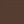 | 
| Green grass | (123, 130, 48) | (0.201, 0.227, 0.074) | 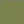 | 
| Desert sand | (177, 167, 132) | (0.448, 0.394, 0.235) |  | 
| Fresh concrete | (185, 181, 175) | (0.494, 0.476, 0.437) |  | 
| Ocean Ice | (187, 191, 192) | (0.536, 0.529, 0.505) |  | 
| White acrylic paint | (227, 227, 227) | (0.767, 0.767, 0.767) |  | 
| Fresh snow | (243, 243, 243) | (0.899, 0.899, 0.899) |  |

### Base Color for Metals (Conductors)

| | sRGB Value | Linear Value  | sRGB swatch |
|--- |--- |--- |--- |
| Iron | (196, 199, 199) | (0.560, 0.570, 0.580) |  | 
| Silver | (252, 250, 245) | (0.972, 0.960, 0.915) |  | 
| Aluminum | (245, 246, 246) | (0.913, 0.921, 0.925) |  | 
| Gold | (255, 226, 155) | (1.000, 0.766, 0.336) | 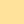 | 
| Copper | (250, 208, 192) | (0.955, 0.637, 0.538) |  | 
| Nickel | (211, 203, 190) | (0.660, 0.609, 0.526) |  | 
| Titanium | (193, 186, 177) | (0.542, 0.497, 0.449) |  | 
| Cobalt | (211, 210, 207) | (0.662, 0.655, 0.634) |  | 
| Platinum | (213, 208, 200) | (0.672, 0.637, 0.585) | 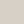 | 

### Base Color - PBR Safe Colors

Each pixel luminance value should be calculated by either 1) averaging the R, G, and B channels, and dividing by 3, OR 2) combined at a weight of 0.299R, 0.587G and 0.114B and divided by 3 (this is the Allegorithmic Substance method which is optimized for producing deep blues and reds). 

The resulting pixel value should be within the PBR acceptable value range (the group needs to close on what this is: Substance validator “red zone”: 30-243 sRBG, Substance validator “orange zone” 50-225sRGB, 2D video sRGB acceptable range 16-235 sRGB, etc.).

In a render any pixel value outside of this determined range would be a result of the texture base color and its interaction with light or shadow (so for example if a pixel showed up as 255 it would be the result of light interacting with a base color pixel valued at 243 or less and not because the base color pixel itself was 255.

#### PBR Safe Color References:
* https://academy.substance3d.com/courses/the-pbr-guide-part-2
* https://blogs.unity3d.com/2015/02/18/working-with-physically-based-shading-a-practical-approach/
* https://docs.unity3d.com/uploads/ExpertGuides/Dark_Dielectric_Materials.pdf 
* https://docs.unrealengine.com/en-US/Engine/Rendering/Materials/PhysicallyBased/index.html
* https://www.fxguide.com/fxfeatured/game-environments-parta-remember-me-rendering/
* https://marmoset.co/posts/physically-based-rendering-and-you-can-too/
* https://seblagarde.wordpress.com/2014/04/14/dontnod-physically-based-rendering-chart-for-unreal-engine-4/

## Alpha Coverage Texture
Alpha Coverage in glTF currently allows two techniques “alpha blending” and “alpha test”.

Transparency in real-world materials like glass, acrylic, and water is fundamentally different from how Alpha Coverage works in glTF. Real-world transparent surfaces often both reflect and transmit light. Completely clear glass transmits light from behind it, but it is also very reflective. Alpha Coverage does not represent this correctly, it simply controls the visibility of the surface, it dims all surface characteristics at once. 

Alpha Coverage should be limited to “cutout” style material effects, such as a leaf texture applied to a quad model. However in practice we must be able to represent semi-transparent materials like glass or water, so we use partial Alpha values like 30% gray. 

Partial alpha allows the Base Color and reflections to be partially seen, for a rough approximation of clear surfaces. This is better than no glass at all, but is not physically correct and thus does not produce accurate results. 

By the end of 2020, improvements in material technology will add better support for partially-transparent surfaces. The upcoming extensions for thin-surface transmission (KHR_materials_transmission) and volume transmission (KHR_materials_volume) will allow for better transparency control and behavior. 

### Alpha Coverage Methods
There are two basic methods for controlling how Alpha Coverage is rendered in glTF materials. 

#### Alpha Blend
This includes materials where the transparency is due to holes in the material so little or no absorption, refractive, or reflective properties are needed. e.g. gauze or burlap with visible gaps between the threads basically behave this way. 

This type of transparency is included in the current glTF 2.0 specification as the alpha channel of the baseColor texture parameter. 

#### Alpha Test 
This type of transparency is used for materials that are either fully transparent or fully opaque, with a hard edge between the two. Also known as Masked, Screendoor, or Cutout.

Typically, a black-and-white texture is used to identify where the material should and shouldn’t be rendered. Note that the texture should have antialiasing between black and white, otherwise stair-stepping artifacts will be more apparent along the edges.

As no blending is required, this method exhibits no render-order or blend-complexity issues like Alpha Blend. 

### Alpha Coverage Values
Alpha Coverage textures use white as completely solid, with grays for levels of partial visibility, and black as completely see-through. 

Alpha Coverage can also use a single value for the whole material, anywhere between 0 for clear and 1 for solid.

### Alpha Coverage in USDz
USDz uses the same convention as glTF. For USDz white is solid, black is clear.

### Alpha Coverage Should be Used Sparingly
Avoid enabling Alpha Coverage if a material has no transparency, for example using a white texture or a 1.0 value to create opaque parts. Alpha Coverage is more expensive to render in real-time, even when completely opaque, so it should be removed when not needed. Alpha Coverage surfaces also use a different rendering method that can cause depth artifacts, which can cause far surfaces to render in front of near surfaces.

Alpha Coverage materials should be kept separate from opaque ones. We suggest splitting models into separate parts, so Alpha Coverage surfaces can be rendered separately. 

Multiple Alpha Coverage surfaces within the same model should also be split into separate parts. This improves rendering by allowing the real-time renderer to render them in order, from back to front. For example if you have a light fixture with a row of five lightbulbs, the glass for each bulb should be a separate part within the overall model. You can reuse the same glass material on all the bulbs, but each bulb should still be a separate part, movable independently from the other bulbs.  Workflow : separating transparent from opaque materials

The total number of separate parts in the average product model should be as few as possible. Only separate the parts that need to be interacted with, for example doors on a cabinet.

### Alpha Coverage Errors
The biggest concern when creating assets with Alpha Coverage is the complexity of rendering triangles in the correct order. Asset creators should not assume perfect depth sorting as most real-time renderers are not able to support this. 

Most renderers will sort on a per-mesh basis and usually render from furthest to closest. Intersecting or overlapping transparent meshes may exhibit rendering problems and should be avoided if possible. 

A less common technique is to rely on triangle-ordering to ensure that transparent triangles render last. Triangles affected by transparency are specifically placed at the end of the rendering process to ensure that they render after all opaque triangles. 

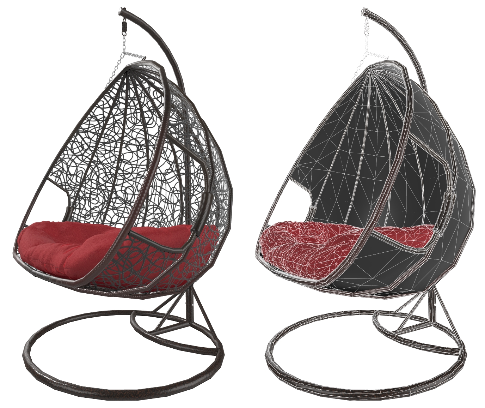

    (C)2020, Wayfair. License: CC BY 4.0 International
    Figure 5.19: A model using Alpha Coverage for the fine wicker detail

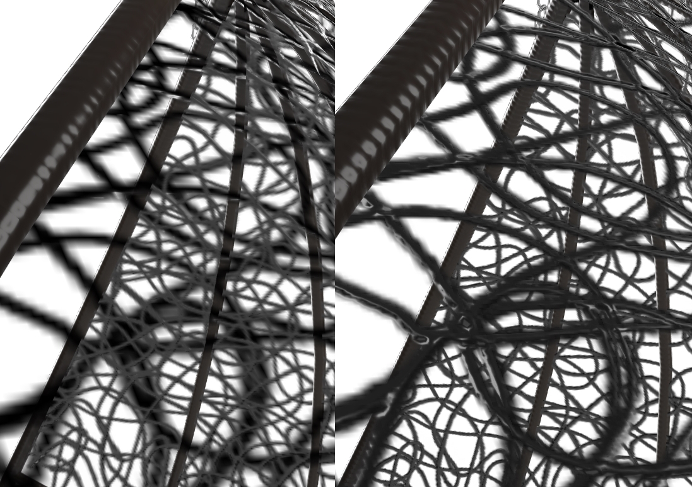

    (C)2020, Wayfair. License: CC BY 4.0 International
    Figure 5.20: A closeup showing depth sorting errors (left) versus correct depth sorting (right)

Real-time renderers use different methods to solve depth sorting with Alpha Blended surfaces, so different fixes may be needed. 

#### Alpha Coverage - Fix Method 1
The most common fix is to detach each Alpha Coverage surface as a separate model. In the wicker example, the triangles that represent the inside squiggly wicker surface would be one model, the triangles for the outside part of the squiggly wicker would be another model, and all the whole rest of the asset (the parts without Alpha Coverage) would be another model.

    (C)2020, Wayfair. License: CC BY 4.0 International
    Figure 5.21: To solve depth sorting errors, Alpha Coverage surfaces can be detached into separate models: inside (red), and outside (green). The rest of the model without Alpha Coverage is shown in blue

#### Alpha Coverage - Fix Method 2
If errors still appear after detaching the surfaces into separate models, another common fix method is to manually change the order that surfaces will be rendered. Detach the mesh elements, and re-attach them in the order you want them to be drawn. In the wicker example, the outside of the basket should always be rendered after the inside; the inside is never seen overtop the outside. To solve this, detach the inside and outside parts, then attach them in rendering order: inside first, then outside after.

#### Alpha Coverage - Fix Method 3
A third fix method is to use Alpha Test instead of Alpha Blend. Alpha Test never has depth sorting errors because there is no blending; pixels are either on or off. This may not work in all situations however, since Alpha Test does not offer partial transparency like what’s needed for glass or liquids.

### Alpha Coverage and Backface Culling
A glTF material can disable backface culling. This causes a single-sided surface to render as two-sided. This is an easy way to reuse the same surface on the front and back of a model. It also reduces the number of vertices on the model, which can reduce the file size. 

Unfortunately, if Alpha Blending is being used, disabling backface culling can cause depth sorting errors. The front and rear surfaces will be in the same model, which often causes depth sorting artifacts. If this occurs it is better to manually duplicate and flip the front triangles, creating a separate model for the rear triangles, then enable backface culling. 

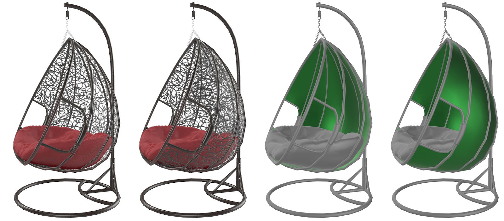

    (C)2020, Wayfair. License: CC BY 4.0 International
    Figure 5.22: From left: wicker chair with backface culling enabled, backface culling disabled, enabled on the green part, disabled

## Base Color Texture
The color and texture of the surface has one of the largest impacts on the visual result. 

The Base Color controls the colors you see when a surface is evenly lit, without reflection in the way.

When using a PBR Metal/Rough material, the Base Color stores the color of the reflections for metals (gold, copper, brass, etc.). When the surface is non-metal, Base Color is used for traditional non-reflective diffuse texture (wood, brick, fabric, etc.).
 

    (C)2020, Wayfair. License: CC BY 4.0 International
    Figure 5.23: The Base Color texture should have no lighting information. Lighting and shading in PBR is provided by the scene
 
If the surface uses Alpha Coverage, it will be stored the alpha channel of the Base Color texture. This is an optimization to reduce the number of separate texture files that need to be sampled into memory at runtime. 
 
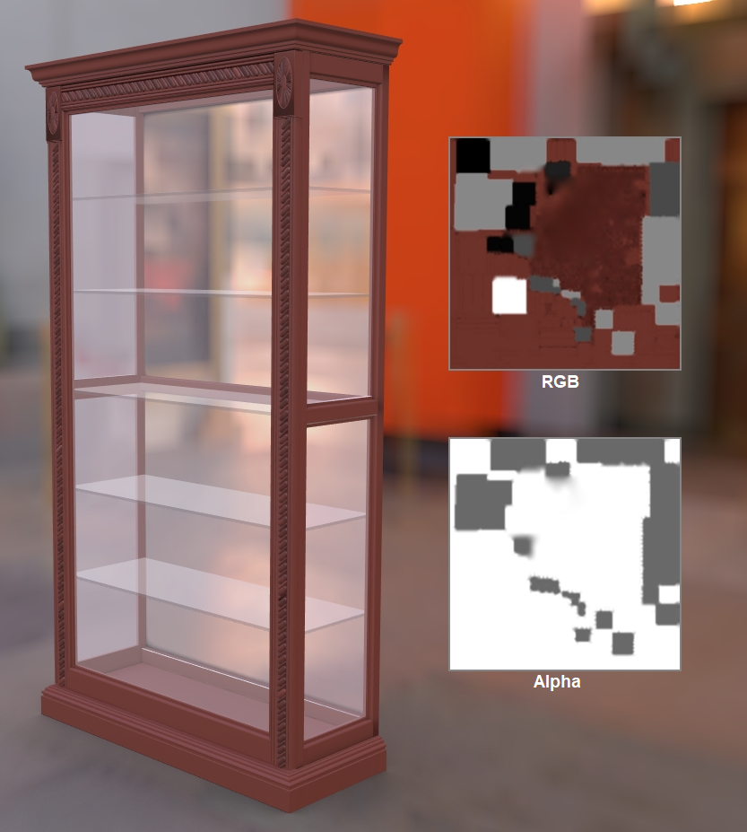

    (C)2020, Wayfair. License: CC BY 4.0 International
    Figure 5.24: Base Color and Alpha Coverage are combined together into a single texture
 
Depending on the exporter you use, the Base Color and Alpha Coverage may be created as separate textures, which the exporter will combine during export. If it does not, you may need to manually put the Alpha Coverage into the alpha channel of the Base Color. 

## Normal Texture

This texture simulates bumpiness on the surface. It creates the illusion of more surface detail or better curvature. However the silhouette of the model doesn't change; this is only a “fake” to simulate detailed lighting in a quick efficient manner.

Normal adds variation in surface direction to simulate grooves, pits, channels, fibers, etc. The texture is used for macro-surface bumpiness. Normal can also be used to store curvature from a higher-detail model, causing a low-resolution model to look like it has more smoothness or detail.

    (C)2020, Wayfair. License: CC BY 4.0 International
    Figure 5.25: A normal map on a model (left), versus without it

The normal map stores a direction for each pixel. These directions are called normals. The red, green, and blue channels of the image are used to control the direction of each pixel's normal.

    (C)2020, Wayfair. License: CC BY 4.0 International
    Figure 5.26a: A normal bump texture

    (C)2020, Wayfair. License: CC BY 4.0 International
    Figure 5.26b: The red channel stores the left-right directions of the pixels

    (C)2020, Wayfair. License: CC BY 4.0 International
    Figure 5.26c: The green channel stores the up-down directions of the pixels

    (C)2020, Wayfair. License: CC BY 4.0 International
    Figure 5.26d: The blue channel stores the in-out directions of the pixels

### Normal - Converted vs. Baked

A Normal texture can be generated using two basic methods: converting a grayscale texture or photo, versus baking it from a model. 

We recommend using converted textures in most cases, since these can be generated easily from scanned swatches, can be easily tiled to create high resolution materials that look good in closeups, and can be reused on more than one model.

A converted Normal map is useful for homogenous repetitive surfaces, for example wood grain or fabric weave or terracotta tiles. It can be repeated across the model to create high-resolution shading details, and can be reused by multiple models. It cannot however reproduce unique location-specific details, like worn edges or non-repeated surface features.

A baked Normal map can be used to transfer the surface details from a high-resolution model onto a lower-resolution model. Each pixel of the Normal map captures the surface slope of the original high-resolution model, so the unique shapes are replicated in the final model. The resolution is limited however because an atlas covers the whole model so it tends to be blurry in closeups. Atlas textures also cannot be reused on different models, the layout is specifically tied to the low-resolution model it was created for.

    (C)2020, Eric Chadwick. License: CC BY 4.0 International
    Figure 5.27: From left, a baked Normal applied to a low-resolution model, the same model without Normal, and the Normal texture displayed in full-bright mode

## Emissive Texture

Emissive simulates glow or self-illumination. Emissive can be used for internal lighting, glow-in-the-dark paint, LED displays, neon, etc.

Parts of the surface can be made to glow, as if lit internally. Emissive usually does not cast light onto other surfaces, it only makes the current surface appear to glow. Emissive is not affected by lighting, it is shown full-bright on the model. Emissive is additive, black causes no change.

For best results, use a ray traced renderer to precalculate bounced lighting and store this in an emissive texture. This is best added when the model and material are near completion, so model details can affect the emissive calculations. 

    (C)2020, Wayfair. License: CC BY 4.0 International
    Figure 5.28: A model with and without an emissive texture. This model uses emissive to simulate the lamp shade being illuminated by the light bulb

## Metalness Texture

The Metalness texture controls which parts of a surface are considered metallic or not. 

Metallic surfaces reflect light very differently from non-metals. Metalness has a large effect on the final color and reflectivity of the surface, as well as informing what color and texture should be stored in Base Color and Roughness.

Metals are often referred to as conductors… electric energy moves quickly through and across them. Non-metals are often called insulators or dielectrics… they inhibit the flow of electric energy. This core difference in material type affects the way light is reflected or absorbed by the surface.

When in doubt, examine the material for two main characteristics:
1. Does the surface reflect the same at facing angles as it does at glancing angles?
1. Are reflections colored?

If either or both are yes, Metalness may be required.

### Metalness Values

The metalness texture uses non-color values. 1.0 white = metal, 0.0 black = non-metal. 

When metalness is white (1.0) the color of the specular reflection is derived from the Base Color texture. When metalness is black (0.0) specular reflections will be the color of the incoming light. 

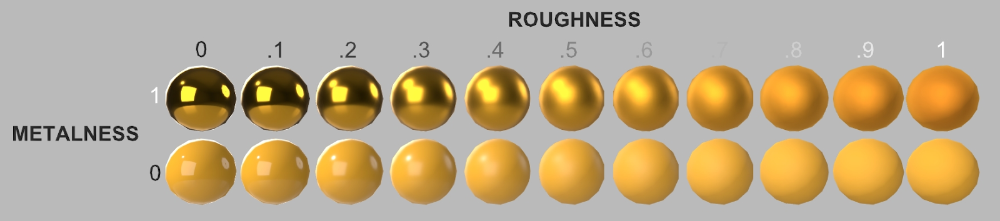

    (C)2020, Wayfair. License: CC BY 4.0 International
    Figure 5.29: Metals (above) colorize their reflections, while non-metals do not. Roughness is increasing left to right

Materials should generally avoid metalness values other than pure black (0.0) and pure white (1.0). However, antialiasing should be used where transitions occur (e.g. chipped paint on metal) to help prevent aliasing in specular reflections.

Gray values may also be necessary for partially-coated metals, or for reflective fabrics. Gray values should be avoided in most cases because these result in non-physical material behavior which can cause unrealistic appearances.

### Metalness Fresnel

Metals reflect light in a different way from non-metals:
1. Metals reflect more intensely on surfaces that face the viewer. 
1. Metals colorize their reflections.

With most materials, surfaces facing the viewer will reflect lighting differently from surfaces perpendicular to the viewer. This effect is commonly called Fresnel. 

Surfaces perpendicular to the viewer will reflect the same on both metals and non-metals. At grazing angles, the two surface types show the same amount of reflection.

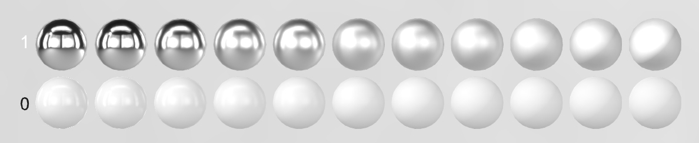

    (C)2020, Wayfair. License: CC BY 4.0 International
    Figure 5.30: Metal (above) versus non-metal. Roughness is increasing left to right

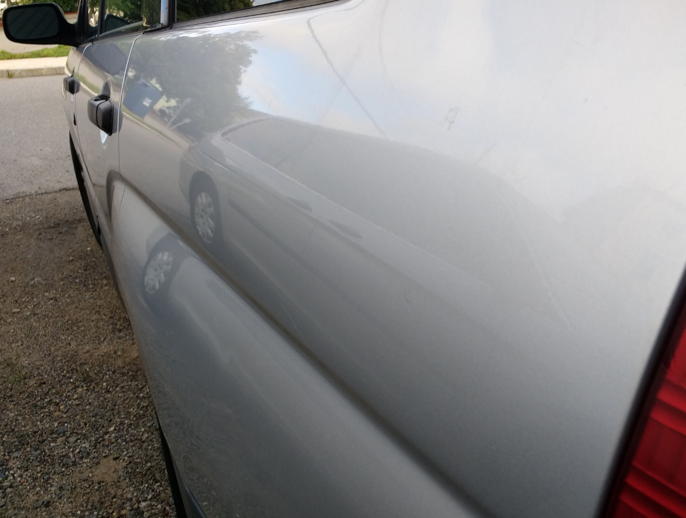

    (C)2020, Wayfair. License: CC BY 4.0 International
    Figure 5.31: Car paint with a clearcoat is not metal. The reflection increases as the surface becomes more perpendicular to the camera, and decreases as it faces more toward the camera. The metalness value for this should be zero or black

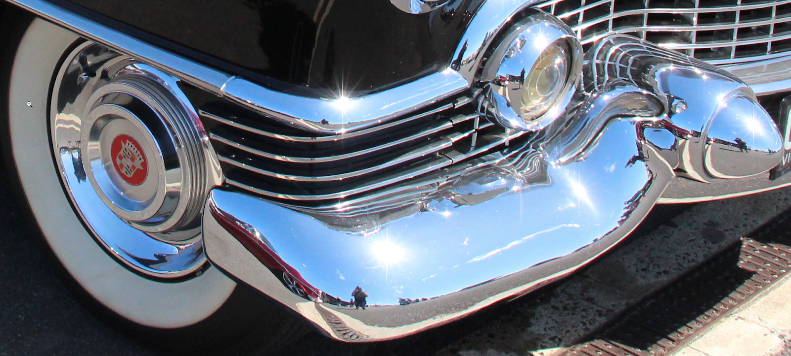

    (C) Sicnag. License: CC BY 2.0 
    Figure 5.32: Chrome is metal. The reflection is the same strength on facing surfaces as at glancing angles. The metalness value should be 1 or white

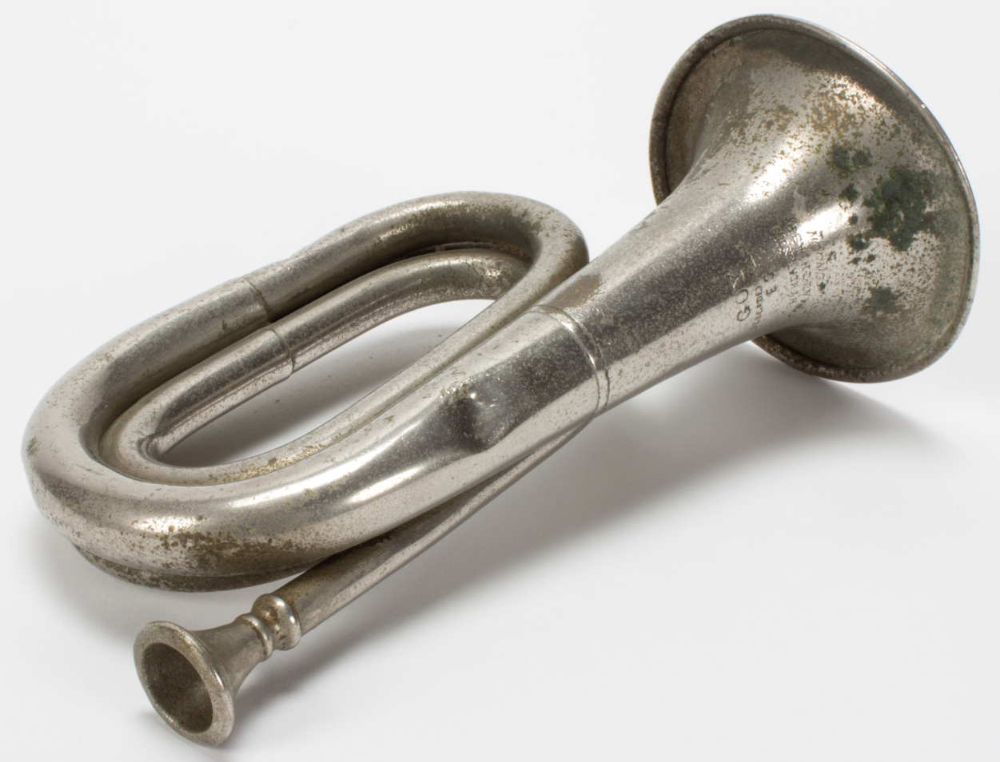

    [Collection of Auckland Museum](https://commons.wikimedia.org/wiki/File:Bugle_(AM_2013.20.5-3).jpg) Tamaki Paenga Hira, 2013.20.5, Gift of Hamish Mickle. License: CC BY 4.0 International
    Figure 5.33: This bugle is chrome with corrosion and oxidation. The metalness texture would be white for the reflective metal, and black for the non-reflective corrosion

### Metalness Reference

* https://www.chaosgroup.com/blog/understanding-metalness

## Occlusion Texture

Ambient occlusion is used for soft shadows wherever model intersections and crevices occur. 

For best results, use a raytraced renderer to precalculate occlusion and store this in an Occlusion texture. Occlusion is best added when the model and material are near completion, so model details can affect the occlusion calculations.  

Do not use occlusion for parts of the model that will be animated, repositioned, or replaced interactively. The soft shadows will not move with them.

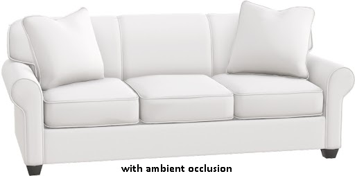

    (C)2020, Wayfair. License: CC BY 4.0 International
    Figure 5.34: A model with and without ambient occlusion

## Roughness Texture

Roughness defines the micro-surface bumpiness, which controls how blurry or sharp the reflections will be. 

1.0 white is rough, 0.0 black is glossy.

    (C)2020, Wayfair. License: CC BY 4.0 International
    Figure 5.35: A model with and without roughness 

Roughness is the inverse of Glossiness. When converting an existing material into glTF PBR Metalness-Roughness, if it has a Glossiness texture you can invert it to create the Roughness texture.

Roughness does not reduce reflection. The same amount of light is reflected. As a surface becomes more rough, the reflection bounces in more directions, in effect it is spread out more widely.

It is recommended to use a Roughness texture whenever possible. Roughness can significantly increase realism. Real-world surfaces are never perfectly smooth: wear, fingerprints, scratches, smudges, bits of dust, etc. In a traditional photo studio, products are usually cleaned before photographs are taken. We can’t avoid all wear and tear though, hands have to touch products. These features generally increase Roughness. It is best to use wear sparingly because a little can go a long way. E-Commerce assets are generally presented in a new and clean state, so it is generally best to keep real-world wear at a subtle level.

## Varying the Texture Resolutions

Textures in a model do not all need to be the same resolution. It is recommended to downsize textures as much as possible to reduce the final GLB file size, without sacrificing quality too much. 

The texture for Base Color often use the highest resolution, since colors are usually the most prominent features on a model. Sometimes the Occlusion/Roughness/Metalness (ORM) texture has less detail, so it can be 1/4 the resolution of the Base Color… if a Base Color texture is 1024x1024, the ORM could be 512x512. 

This is highly dependent on the model, and should be assessed by the content creator. Some models may have very few details in the Base Color, and more details in the ORM, so the situation could be reversed.

Recommended texture sizes are covered in Publishing Targets.

## Powers of Two

Textures should always use width and height dimensions in powers-of-two. 4,8,16,32,64,128,256,512,1024,2048.

Texture resolutions should be powers-of-two so they can be downsized to create MIPs.

To render a texture more smoothly on a real-time 3D model, it is resized multiple times to make "MIPs," which are smaller versions of the texture. These smaller versions are swapped or blended with the original texture as the model recedes in the scene.

The term MIP is based on the Latin phrase multum in parvo, meaning "much in a small space". 

Without MIPs a texture will shimmer, because the screen pixels must quickly switch from one color to another as the texture pixels get smaller than the screen pixels. 

## Texture Dimensions: Square vs. Rectangular

Texture dimensions can be either square (e.g. 1024x1024) or not square (e.g. 1024x256). 

Most models tend to use square textures. Non-square dimensions are useful when the model UV coordinates do not fit nicely into a square layout. 

It is best not to waste texture space; always use the smallest dimensions possible, and try to fill as much of the texture as possible with UVs.

## File formats

PNG and JPG are the most commonly-used texture formats in glTF materials. Which format you use will depend on the model.

Recommended formats:
* Base Color = JPG (PNG required if Alpha Coverage is used)
* Emissive = JPG
* Normal = PNG
* Occlusion/Roughness/Metalness = PNG
* Alpha Coverage = PNG required, stored in alpha channel of Base Color

JPG is a lossy format. It is generally preferred for smaller file sizes, at the expense of causing greater visual artifacts. JPG can use varying levels of compression, creating smaller file sizes but greater visual noise.

Some textures respond better to JPG compression than others, causing less noisy results at stronger compression levels. The closer a texture is to a photo the better it will look as a JPG, because the three color channels (Red/Green/Blue) are usually similar in content. Base Color and Emissive generally work well as JPG files. When ORM and Normal are saved as JPG they can cause significant artifacts on the model, so it is generally recommended to use PNG for these texture types.

24bit PNG is a lossless format. It is generally preferred for higher quality results, often at the expense of larger file sizes than JPG. PNG compression will only reduce file size when a texture has large areas of flat color.

32bit PNG is the same as 24bit PNG, with an additional channel for alpha. This is used to store the Alpha Coverage texture. JPG cannot be used for Alpha Coverage because it does not allow an alpha channel.

## Future Materials Development

## KTX2 Textures

KTX2 texture format is currently unavailable, but coming soon. It is in active development and nearing ratification as a universal standard. KTX2 offers significant texture compression with minimal artifacting, and recompresses dynamically into hardware-supported texture format. This will dramatically improve texture resolution and reduce file sizes, both for file transmission and memory use during rendering.

## PBR Next

Significant extensions to glTF materials are currently in development. These new features will allow better transparency (glass, gemstones, liquids), clearcoat layering (vehicle paint, carbon fiber), sheen (velvet, microfiber textiles), specular and ior (various), anisotropy (grooved metal, fibers, hair), subsurface scattering (skin, wax, foliage), and more.

* ADOBE_materials_clearcoat_tint
* KHR_materials_anisotropy
* KHR_materials_clearcoat
* KHR_materials_ior
* KHR_materials_sheen
* KHR_materials_specular
* KHR_materials_thinfilm
* KHR_materials_translucency
* KHR_materials_transmission
* KHR_materials_volume
 
See [PBR Next](https://github.com/KhronosGroup/glTF/milestone/2) for more information.

  

[<ins>Return to <em>Asset Creation Guidelines Summary</em></ins>](/asset-creation-guidelines/RealtimeAssetCreationGuidelines.md)
