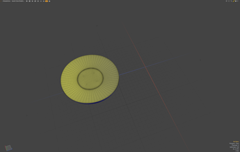
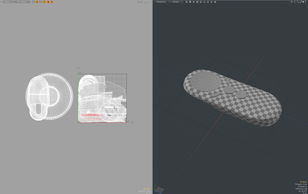

##### Michael Badillo

##### Samsung Research of America

##### 2/4/2021
# Optimizing a high resolution source model for real-time

## About

In this document we will walk through the process of optimizing a CAD model and produce a 3D asset to be used for real-time rendering. 

**Difficulty Level: Beginner**

## Topics Covered:

- [ ] Check scale of object
- [ ] Remove geometry not visible to the user
- [ ] Check the UV's
- [ ] Generate Materials 
- [ ] Export to GLTF
- [ ] Review GLTF in Viewer

## Our Make Believe Backstory

The 3D model is a make-believe handheld game controller for an upcoming next generation AR game system set to ship by 4th quarter 2021. This game system is expected to change the way gamers play their favorite games! As an avid gamer, you are very excited about this new device.  \
The manufacturing team sent the marketing team a 3D CAD model originally used to 3D print a prototype of an AR game controller.  The marketing team's 2D UX artist working on the product's website does not have much experience working with 3d assets. When the 2D artist added textures and exported this asset as GLTF using Blender, the textured model does not look quite right. When the asset is loaded on a phone, the framerate is low. A producer from the marketing team chose you to fix these rendering issues and optimize this model to run on older mobile phone web browsers.

## Import and Reviewing the 3D Asset
You receive the asset in .OBJ format and import the .OBJ file into one of your favorite 3D content creation software.

You inspect the model and note the meshes included are the following:

Trigger  \
TriggerHousing  \
Pad  \
PadHousing \
Topplate \
Midplate \
Bottomplate \
Button1 \
Button2 \
Button3 \
Button4

The total number of triangles for all of these meshes equal 87,996 triangles or 45,591 vertices.
## Mesh dimensions

You review the dimensions of the imported geometry and confirm with the manufacturing team the size of the object is the intended real world scale. 

## A closer view of the meshes

You decide to translate the meshes to gain a greater understanding of the geometry included in the scene.
The marketing team confirmed the website will never present the asset in expanded view. They want to see the model as a whole, and will never isolate each mesh for the user to inspect. They have not decided about animating this asset. As a result, you decide to delete the meshes which will be unseen by the user.

## Can’t see it?  Delete it!

**Workflow hint #1: Delete the meshes and polygons you know will never be viewed by the user.**

The meshes TriggerHousing, Padhousing and Midplate will never be viewed by the user.  As a result these meshes will be deleted from the scene.

These 3 meshes consisted of 16,132 triangles and 8,396 vertices.

The controller meshes now total 44,285 triangles or 37,195 vertices. Your gut feeling tells you these numbers  seem very high for a real-time asset, and you want to milk performance from older generation mobile hardware. You have a closer look to see where you can trim some more geometry.

You take a closer look at the remaining meshes, starting with the Bottomplate mesh.
This mesh contains 27,579 triangles.  The user will never see the inside of this mesh. You decide to delete the unnecessary geometry which is the geometry representing the 'inside' of the Bottomplate.

You select the geometry inside the Bottomplate and delete this geometry.

You have a closer look at the Topplate and Pad meshes.

You decide to delete the Topplate geometry underneath the Pad geometry, as noone will be able to view this geometry when the object is rendered in real-time.

You move on to clean up the button geometry and decide to delete the geometry which might represent rubber gaskets under each button, as they will never be seen.

UV Layout ( Not to be confused with the Headus app )
Workflow hint #2 - Laying out your UV's

Now that you have a 1st pass on optimizing your model, you decide to move on to the object's uv’s.
At first glance you notice how you can improve the uv layout by laying out all of the geometry into 0-1 uv space. You also decide to distribute the texel* space more evenly. The texels representing the pad and button geometry are much smaller than the rest of the object’s geometry.

**Before**

Using the application’s ( in this case Modo ) uv tools, you reach the following uv layout result. The new uvs exist in 0-1 uv space. You decide to combine all of the mesh elements into a single mesh node.
The model now consists of 23048 vertices and 45,712 triangles. This resolution is much better than the original model, but likely still too high resolution for an older mobile device.
Regardless, at this point you decide to export this model as .fbx to texture this model with Substance Painter.

**After**

Modo provides a helpful feature for setting real world size for texel density.  

UV Links: \
https://learn.foundry.com/modo/901/content/help/pages/uving/working_with_uvmaps.html  \
https://www.youtube.com/watch?v=qRDgF7ZfaTA

Texels: \
https://en.wikipedia.org/wiki/Texel_(graphics)  

## Substance Painter

Open Substance painter, create a new scene and import the game-controller.fbx file.

Set Substance Painter to bake the mesh textures so you can start applying some materials to the object.  

Marketing did not send you a render of the final product, so you do  your best to generate some generic materials to start to gain a sense of what this controller might look like.

Quickly start to mask out materials by adding masks and changing the alpha value on various mesh objects using the polygon fill tool.

Evaluate your scene after applying a few generic stock substance materials. Depending on the timeline of your product workflow, you may not have information regarding the final product’s intended design by the manufacturer.

After a couple of minutes of playing around with the stock textures, you decide on the following material settings.

Export the GLTF file for the marketing department for review and feedback.

File->Export Textures (CTRL-SHIT + E )  
Export->Config = gLTF PBR Metal Roughness  
Export button  

After exporting the files you quickly review the files exported by loading the exported files into your favorite glTF Viewer.

List of viewers :  
https://gltf-viewer.donmccurdy.com/  
https://threejs.org/editor/   
https://sandbox.babylonjs.com/  
https://modelviewer.dev/examples/tester.html   

List of certified viewers :  ?

Publishing targets: 
https://github.com/KhronosGroup/3DC-Asset-Creation/blob/main/asset-creation-guidelines/full-version/sec99_PublishingTargets/PublishingTargets.md

References \
Software links:\
https://www.substance3d.com/products/substance-painter/  \
https://www.foundry.com/products/modo  \
https://www.uvlayout.com/ 

Masking \
https://docs.substance3d.com/spdoc/smart-materials-and-masks-109609006.html \
https://docs.substance3d.com/spdoc/quick-mask-29130795.html 

Polygon Fill \
https://docs.substance3d.com/spdoc/polygon-fill-34275386.html

Possible storylines for possible upcoming workflows.
1. Marketing changed their mind and wants to animate the buttons. ( Animation workflow ) \
2. The framerate is still too low, they want you to optimize the asset to be 10k triangles total.
( Retopology workflow )

